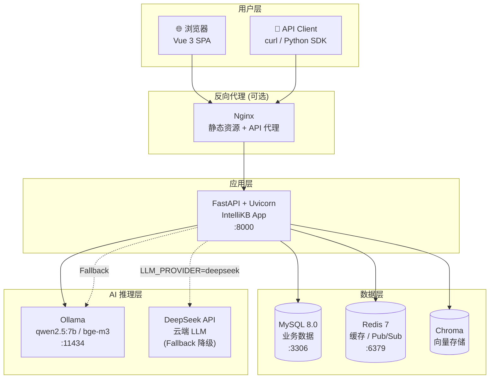

# IntelliKB — AI 智能知识库平台

> 🧠 基于 RAG + Agent 的企业级智能知识库平台 — 本地 Ollama 驱动，支持云端 DeepSeek 增强

[](https://python.org)
[](https://fastapi.tiangolo.com)
[](https://vuejs.org)
[](https://github.com/qianlin-code/IntelliKB/actions/workflows/ci.yml)
[](LICENSE)

---

## 状态

🚀 **v1.0.1 已发布** — 首个生产就绪版本（含上线前关键热修）

---

## 核心功能矩阵

### Phase 0-2: 基础平台

| 功能 | 说明 |
|------|------|
| ✅ JWT + API Key 双认证 | Bearer Token + X-API-Key + Cookie (SSE) |
| ✅ 知识库 CRUD | 创建/查看/更新/删除，owner 独享操作 |
| ✅ 成员权限 | owner / editor / viewer 三级 KB 角色 |
| ✅ 多格式文档上传 | PDF / DOCX / MD / TXT，魔数校验 |
| ✅ 异步解析 + SSE 进度 | BackgroundTasks + Redis Pub/Sub |
| ✅ BM25 + 向量混合检索 | RRF 融合 + Cross-encoder Rerank |
| ✅ RAG 问答 | 非流式 + SSE 流式 |
| ✅ 查询改写 | LLM-based 多轮指代消解 |

### Phase 3-6: 智能对话

| 功能 | 说明 |
|------|------|
| ✅ Agent ReAct 对话 | 本地 Ollama / 云端 DeepSeek 双模 |
| ✅ Token 级流式 SSE | 打字机效果逐 token 输出 |
| ✅ MySQL Checkpointer | 对话中断恢复 + 多轮上下文持久化 |
| ✅ 语义标题 | LLM 自动生成对话标题 |
| ✅ 模型 Provider 热切换 | Ollama / DeepSeek / 通义千问 / OpenAI |
| ✅ 云端 Fallback | DeepSeek 故障 → 本地 Ollama 自动降级 |
| ✅ 成本追踪 | Redis 日/月 token 计数 + 限额检查 |

### Phase 7-8: 质量增强

| 功能 | 说明 |
|------|------|
| ✅ Reranker 离线化 | 三层降级：bge-reranker-base → ms-marco → disable |
| ✅ 健康检查 + 就绪探针 | `/api/v1/health` + `/api/v1/ready` |
| ✅ Token 精确计数 | 从 `response.usage` 取值 |
| ✅ 中文 Reranker 升级 | bge-reranker-base (~1.3GB, 6GB VRAM) |
| ✅ 查询重写策略 A/B/C | 指代消解 / 问题拆解 / 关键词提取 |
| ✅ 答案引用溯源 | `[source:N]` + 前端弹窗显示原文 |
| ✅ 多轮对话优化 | 指代词检测 + 上下文摘要注入 |
| ✅ 语义分块 | 按标题/段落/句子边界切分 |
| ✅ RAG 评测 | Hit Rate / MRR / Recall + Badcase 面板 |
| ✅ Agent 推荐问题 | 3 个后续问题自动生成 |

### Phase 9-10: 体验与管理

| 功能 | 说明 |
|------|------|
| ✅ 会话导出 | Markdown（含来源引用）|
| ✅ 对话搜索 | 标题+消息内容搜索、KB 筛选、日期范围 |
| ✅ Agent 人设 | 每 KB 自定义 system_prompt |
| ✅ 来源面板 | 双向高亮交互 + 移动端抽屉 |
| ✅ 消息编辑重新生成 | 截断+重调 Agent |
| ✅ 会话置顶/收藏 | is_pinned/is_starred |
| ✅ 推荐问题刷新 | "换一批"按钮 |
| ✅ RBAC 双层权限 | superadmin/admin/user + KB owner/editor/viewer |
| ✅ 审计日志 | 16 种操作类型、异步写入、6 维筛选 |
| ✅ 资源配额 | KB 数/文档数/成员数/存储空间 |
| ✅ API Key 管理 | 名称/启用/月配额/用量 |
| ✅ 管理后台前端 | 用户管理/审计日志/系统配置/统计 |

---

## 技术栈

| 层 | 技术 | 版本 |
|---|------|:----:|
| 后端框架 | FastAPI + Uvicorn | 0.115+ |
| 数据库 | MySQL 8.0 (SQLAlchemy async + aiomysql) | 8.0 |
| 缓存/消息 | Redis (async, Pub/Sub) | 7.x |
| 向量存储 | Chroma | 0.6+ |
| Embedding | bge-m3 / nomic-embed-text (Ollama) | — |
| Agent 框架 | LangGraph | 0.2.x |
| LLM 推理 | Ollama (qwen2.5:7b) / DeepSeek | — |
| Reranker | bge-reranker-base / ms-marco-MiniLM | — |
| 前端 | Vue 3 + TypeScript + Pinia + Element Plus | 3.5 |
| 构建工具 | Vite (Rolldown) | 8.x |
| 容器化 | Docker + docker-compose | — |

### 硬件要求

| 组件 | 最低 | 推荐 |
|------|------|------|
| CPU | 4 核 | 8 核 |
| RAM | 8 GB | 16 GB |
| VRAM (Ollama) | 6 GB (qwen2.5:7b) | 16 GB |
| 磁盘 | 20 GB | 50 GB+ (模型缓存) |

---

## 快速开始

### 前置条件

- Docker 24+ & Docker Compose v2
- Ollama (本地模式) — 或 DeepSeek API Key (云端模式)
- 8 GB+ RAM

### Docker Compose 一键启动

> **中国大陆用户前置步骤**：Docker Hub 可能连接超时，请先
> [配置 Docker 镜像加速器](docs/deployment.md#0-docker-镜像加速器配置中国大陆用户)。

```bash
# 1. 克隆项目
git clone https://github.com/qianlin-code/IntelliKB.git
cd IntelliKB

# 2. 配置环境变量
cp .env.example .env
# 编辑 .env 设置 SECRET_KEY、DB 密码，以及 LLM/Ollama 地址
# Docker 环境下 Ollama 地址必须使用 http://host.docker.internal:11434/v1

# 3. 启动本地 Ollama（docker-compose 不包含 Ollama 服务）
# 先确保本机已安装 Ollama，并拉取所需模型：
#   ollama pull qwen2.5:7b
#   ollama pull nomic-embed-text

# 4. 启动数据库/缓存/应用服务（首次构建使用 --build）
docker compose up -d --build

# 5. 等待健康检查通过
docker compose ps

# 6. 初始化（创建数据库 + 超级管理员）
# Linux/macOS: bash scripts/init.sh
# Windows:    powershell -File scripts/init.ps1

# 7. 访问
# 前端: http://localhost:5173
# API:  http://localhost:8000/docs
# 管理后台: http://localhost:5173/admin (admin 用户)
```

### 本地开发

```bash
# 后端
pip install -r requirements.txt
cp .env.example .env  # 编辑: DB_HOST=localhost, REDIS_HOST=localhost
alembic upgrade head
uvicorn app.main:app --reload

# 前端
cd frontend
npm install
npm run dev
```

---

## 环境变量

### 数据库

| 变量 | 默认值 | 说明 |
|------|--------|------|
| `DB_HOST` | `mysql` | Docker 内用 `mysql`，本地用 `localhost` |
| `DB_PORT` | `3306` | |
| `DB_USER` | `intellikb` | |
| `DB_PASSWORD` | — | **必须修改** |
| `DB_NAME` | `intellikb` | |

### Redis

| 变量 | 默认值 | 说明 |
|------|--------|------|
| `REDIS_HOST` | `redis` | |
| `REDIS_PORT` | `6379` | |
| `REDIS_PASSWORD` | — | 可选 |

### LLM / Ollama

| 变量 | 默认值 | 说明 |
|------|--------|------|
| `LLM_PROVIDER` | `ollama` | ollama / deepseek / qwen / openai |
| `LLM_BASE_URL` | `http://localhost:11434/v1` | 本地开发用 localhost；Docker 内必须改为 `http://host.docker.internal:11434/v1` |
| `LLM_MODEL_NAME` | `qwen2.5:7b` | |
| `AGENT_MODEL` | `qwen2.5:7b` | Agent 专用模型 |
| `OLLAMA_BASE_URL` | `http://localhost:11434/v1` | 独立 fallback 地址；Docker 内同样用 `http://host.docker.internal:11434/v1` |
| `CLOUD_API_KEY` | — | 云端 provider 的 API Key |

### Reranker

| 变量 | 默认值 | 说明 |
|------|--------|------|
| `RERANK_ENABLED` | `true` | |
| `RERANK_MODEL_ZH` | `BAAI/bge-reranker-base` | 中文优化 (~1.3GB) |
| `RERANK_MODEL_FALLBACK` | `cross-encoder/ms-marco-MiniLM-L-6-v2` | 英文通用 (~200MB) |
| `RERANK_LOCAL_DIR` | `./reranker_models` | |

### 配额 (Phase 10)

| 变量 | 默认值 | 说明 |
|------|--------|------|
| `QUOTA_ENABLED` | `false` | 启用配额控制 |
| `QUOTA_MAX_KB_PER_USER` | `10` | |
| `QUOTA_MAX_DOCUMENTS_PER_KB` | `100` | |
| `QUOTA_MAX_STORAGE_MB_PER_USER` | `500` | |

---

## 部署架构



详见 [部署文档](docs/deployment.md) 和 [架构概览](docs/architecture-overview.md)。

---

## 目录结构

```
IntelliKB/
├── app/                     # 后端 FastAPI 应用
│   ├── api/v1/              # REST API 路由 (9 个模块)
│   ├── agent/               # LangGraph Agent (graph + tools)
│   ├── core/                # 基础设施 (DB, Redis, JWT, 中间件)
│   ├── models/              # SQLAlchemy ORM 模型 (12 个)
│   ├── repositories/        # 数据访问层
│   ├── schemas/             # Pydantic 请求/响应
│   └── services/            # 业务逻辑层 (22 个服务)
├── frontend/                # Vue 3 SPA 前端
│   └── src/
│       ├── api/             # API 封装 (8 个模块)
│       ├── components/      # UI 组件 (11 个)
│       ├── views/           # 页面 (12 个页面含 admin)
│       ├── store/           # Pinia 状态管理
│       └── router/          # Vue Router
├── alembic/                 # 数据库迁移 (10 个版本)
├── docs/                    # 文档 (15+ 篇)
├── scripts/                 # 工具脚本
├── tests/                   # 测试 (单元 + 集成)
├── docker-compose.yml
├── Dockerfile
└── .env.example
```

---

## 文档导航

| 文档 | 说明 |
|------|------|
| [架构概览](docs/architecture-overview.md) | 分层架构、ER 图、管线流程、认证体系 |
| [部署指南](docs/deployment.md) | Docker Compose 部署、环境变量、离线部署、常见问题 |
| [技术债务](docs/tech-debt.md) | 已知问题与改进建议 |
| [路线图](docs/roadmap.md) | 已完成 Phase 0-11 + 未来方向 |
| [测试报告](docs/test-report-v1.0.1.md) | v1.0.1 回归测试 111 用例全绿 |
| [Phase 4 验收](docs/phase4-acceptance.md) | Phase 4 质量增强验收 |
| [Phase 5 验收](docs/phase5-acceptance.md) | Phase 5 体验增强验收 |
| [Phase 6 验收](docs/phase6-acceptance.md) | Phase 6 云端 Agent 激活验收 |
| [Phase 7 验收](docs/phase7-acceptance.md) | Phase 7 生产就绪加固验收 |
| [Phase 8 验收](docs/phase8-acceptance.md) | Phase 8 RAG 质量飞跃验收 |
| [Phase 9 验收](docs/phase9-acceptance.md) | Phase 9 用户体验验收 |
| [Phase 10 验收](docs/phase10-acceptance.md) | Phase 10 企业级管理验收 |
| [Phase 11 验收](docs/phase11-acceptance.md) | Phase 11 项目收尾验收 |
| [技术债 ADR](docs/adr/001-tech-debt.md) | 架构决策记录 |

---

## 开发指南

### 运行测试

```bash
# 单元测试
pytest tests/ -v

# 集成测试 (需要 MySQL + Redis + Ollama)
pytest tests/integration/ -v -m integration
```

### 代码质量

```bash
ruff check app/          # Lint
ruff format app/         # Format
```

### 数据库迁移

```bash
alembic revision --autogenerate -m "description"   # 生成迁移
alembic upgrade head                                # 应用迁移
alembic downgrade -1                                # 回退
```

---

## 许可证

MIT License — 详见 [LICENSE](LICENSE)。
