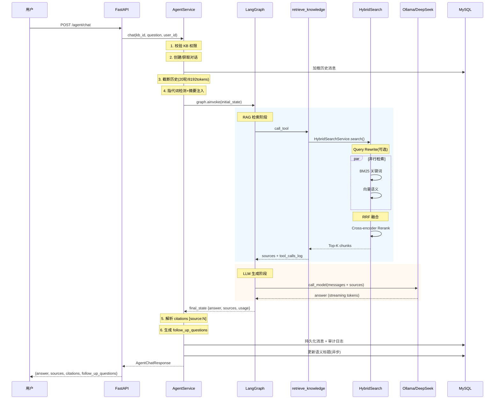
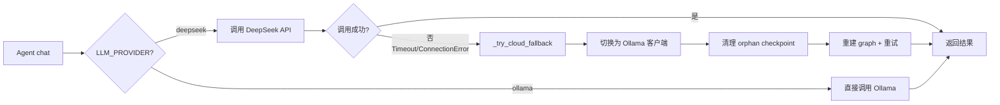

# Agent 对话 + RAG 检索流程

```mermaid
sequenceDiagram
    participant U as 用户
    participant API as FastAPI
    participant AS as AgentService
    participant LG as LangGraph
    participant Tool as retrieve_knowledge
    participant Search as HybridSearch
    participant LLM as Ollama/DeepSeek
    participant DB as MySQL

    U->>API: POST /agent/chat
    API->>AS: chat(kb_id, question, user_id)

    Note over AS: 1. 校验 KB 权限
    Note over AS: 2. 创建/获取对话
    AS->>DB: 加载历史消息
    Note over AS: 3. 截断历史(20轮/8192tokens)
    Note over AS: 4. 指代词检测+摘要注入

    AS->>LG: graph.ainvoke(initial_state)

    rect rgb(240, 248, 255)
        Note over LG: RAG 检索阶段
        LG->>Tool: call_tool
        Tool->>Search: HybridSearchService.search()
        Note over Search: Query Rewrite(可选)
        par 并行检索
            Search->>Search: BM25 关键词
            Search->>Search: 向量语义
        end
        Note over Search: RRF 融合
        Search->>Search: Cross-encoder Rerank
        Search-->>Tool: Top-K chunks
        Tool-->>LG: sources + tool_calls_log
    end

    rect rgb(255, 248, 240)
        Note over LG: LLM 生成阶段
        LG->>LLM: call_model(messages + sources)
        LLM-->>LG: answer (streaming tokens)
    end

    LG-->>AS: final_state {answer, sources, usage}

    Note over AS: 5. 解析 citations [source:N]
    Note over AS: 6. 生成 follow_up_questions
    AS->>DB: 持久化消息 + 审计日志
    AS->>DB: 更新语义标题(异步)

    AS-->>API: AgentChatResponse
    API-->>U: {answer, sources, citations, follow_up_questions}
```

## Agent Fallback 流程

```mermaid
graph LR
    A[Agent chat] --> B{LLM_PROVIDER?}
    B -->|ollama| C[直接调用 Ollama]
    B -->|deepseek| D[调用 DeepSeek API]
    D --> E{调用成功?}
    E -->|是| F[返回结果]
    E -->|否<br/>Timeout/ConnectionError| G[_try_cloud_fallback]
    G --> H[切换为 Ollama 客户端]
    H --> I[清理 orphan checkpoint]
    I --> J[重建 graph + 重试]
    J --> F
    C --> F
```
