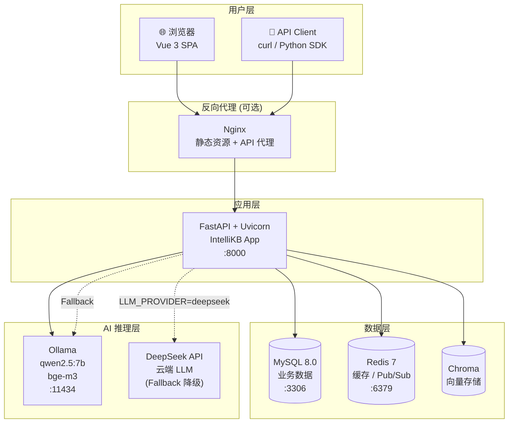

# 部署架构图

```mermaid
graph TB
    subgraph "用户层"
        Browser["🌐 浏览器<br/>Vue 3 SPA"]
        API_Client["📡 API Client<br/>curl / Python SDK"]
    end

    subgraph "反向代理 (可选)"
        Nginx["Nginx<br/>静态资源 + API 代理"]
    end

    subgraph "应用层"
        FastAPI["FastAPI + Uvicorn<br/>IntelliKB App<br/>:8000"]
    end

    subgraph "数据层"
        MySQL[("MySQL 8.0<br/>业务数据<br/>:3306")]
        Redis[("Redis 7<br/>缓存 / Pub/Sub<br/>:6379")]
        Chroma[("Chroma<br/>向量存储")]
    end

    subgraph "AI 推理层"
        Ollama["Ollama<br/>qwen2.5:7b<br/>bge-m3<br/>:11434"]
        DeepSeek["DeepSeek API<br/>云端 LLM<br/>(Fallback 降级)"]
    end

    Browser --> Nginx
    API_Client --> Nginx
    Nginx --> FastAPI

    FastAPI --> MySQL
    FastAPI --> Redis
    FastAPI --> Chroma
    FastAPI --> Ollama
    FastAPI -.->|LLM_PROVIDER=deepseek| DeepSeek
    FastAPI -.->|Fallback| Ollama
```
