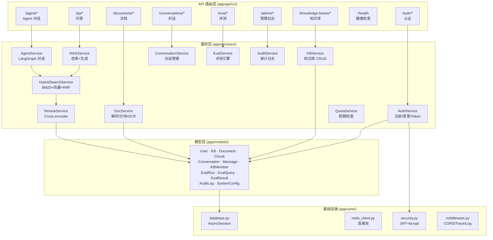

# 后端分层架构

```mermaid
graph TB
    subgraph "API 路由层 (app/api/v1/)"
        Auth["/auth/*<br/>认证"]
        KB["/knowledge-bases/*<br/>知识库"]
        Doc["/documents/*<br/>文档"]
        QA["/qa/*<br/>问答"]
        Agent["/agent/*<br/>Agent 对话"]
        Conv["/conversations/*<br/>对话"]
        Eval["/eval/*<br/>评测"]
        Health["/health<br/>健康检查"]
        Admin["/admin/*<br/>管理后台"]
    end

    subgraph "服务层 (app/services/)"
        AuthSvc["AuthService<br/>注册/登录/Token"]
        KBSvc["KBService<br/>知识库 CRUD"]
        DocSvc["DocService<br/>解析/分块/OCR"]
        RAGSvc["RAGService<br/>检索+生成"]
        HybridSvc["HybridSearchService<br/>BM25+向量+RRF"]
        AgentSvc["AgentService<br/>LangGraph 对话"]
        ConvSvc["ConversationService<br/>对话管理"]
        RerankSvc["RerankService<br/>Cross-encoder"]
        EvalSvc["EvalService<br/>评测引擎"]
        QuotaSvc["QuotaService<br/>配额检查"]
        AuditSvc["AuditService<br/>审计日志"]
    end

    subgraph "模型层 (app/models/)"
        Models["User · KB · Document · Chunk<br/>Conversation · Message · KBMember<br/>EvalRun · EvalQuery · EvalResult<br/>AuditLog · SystemConfig"]
    end

    subgraph "基础设施 (app/core/)"
        DB["database.py<br/>AsyncSession"]
        RedisCore["redis_client.py<br/>连接池"]
        Security["security.py<br/>JWT+bcrypt"]
        MW["middleware.py<br/>CORS/Trace/Log"]
    end

    Auth --> AuthSvc
    KB --> KBSvc
    Doc --> DocSvc
    QA --> RAGSvc
    Agent --> AgentSvc
    Conv --> ConvSvc
    Eval --> EvalSvc
    Admin --> AuditSvc

    AuthSvc --> Models
    KBSvc --> Models
    DocSvc --> Models
    RAGSvc --> HybridSvc
    AgentSvc --> HybridSvc
    HybridSvc --> RerankSvc

    Models --> DB
    RerankSvc --> Models
    AuthSvc --> Security
```
