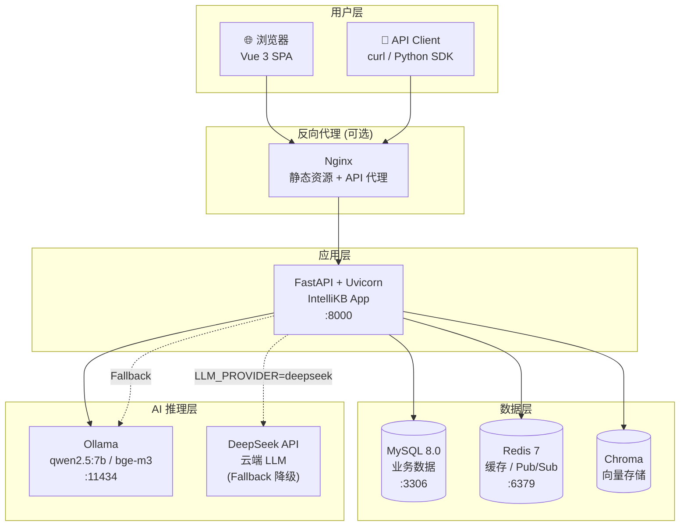
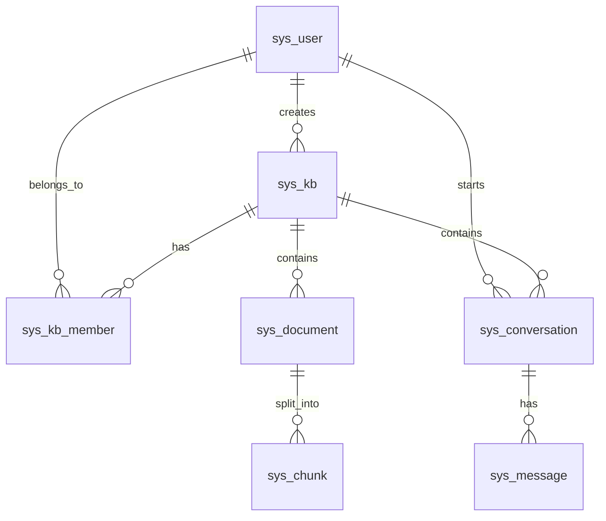
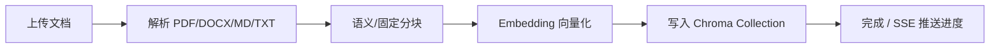

# IntelliKB 智能知识库平台 —— 面试级深度解析

> 本文档面向需要从 0 到 1 理解 IntelliKB 项目的读者，尤其适合准备技术面试时梳理项目脉络、技术选型、难点与解决方案。文档包含架构图、核心代码片段、数据流说明和高频面试题参考答案。

---

## 目录

1. [项目定位与一句话描述](#1-项目定位与一句话描述)
2. [技术栈全景](#2-技术栈全景)
3. [系统部署架构](#3-系统部署架构)
4. [后端分层架构](#4-后端分层架构)
5. [数据模型与 ER 关系](#5-数据模型与-er-关系)
6. [核心模块详解](#6-核心模块详解)
   - 6.1 认证体系（JWT / API Key / SSE Cookie）
   - 6.2 文档处理管线
   - 6.3 RAG 检索管线（BM25 + 向量 + Rerank）
   - 6.4 Agent 对话架构（LangGraph ReAct）
   - 6.5 SSE 流式传输
   - 6.6 前端集成
7. [关键技术难点与解决方案](#7-关键技术难点与解决方案)
8. [高频面试题与参考答案](#8-高频面试题与参考答案)
9. [附录：推荐阅读的源码入口](#9-附录推荐阅读的源码入口)

---

## 1. 项目定位与一句话描述

**IntelliKB** 是一个面向企业场景的 AI 智能知识库平台，基于 **RAG（检索增强生成）+ Agent（ReAct 智能体）** 架构实现。它允许用户上传 PDF / DOCX / Markdown / TXT 等文档，自动完成解析、分块、向量化索引，随后通过自然语言进行：

- **仅检索**：返回与问题最相关的文档片段及相似度。
- **RAG 问答**：基于检索结果让 LLM 生成带引用来源的回答。
- **Agent 对话**：支持多轮上下文、工具调用、云端 fallback 的智能对话。

> 一句话面试版：IntelliKB 是一个基于 FastAPI + Vue3 + Chroma + Ollama 的 RAG 知识库平台，支持文档解析、混合检索、LLM 问答、Agent 多轮对话和企业级权限管理。

---

## 2. 技术栈全景

| 层级           | 技术                                      | 版本/说明            | 选型理由                                      |
| -------------- | ----------------------------------------- | -------------------- | --------------------------------------------- |
| **后端框架**   | FastAPI + Uvicorn                         | 0.115+               | 原生异步、自动生成 OpenAPI、适合 SSE 流式     |
| **数据库**     | MySQL 8.0 + SQLAlchemy 2.0 async          | aiomysql 驱动        | 业务数据持久化、异步 ORM                      |
| **缓存/消息**  | Redis 7                                   | async redis-py       | Token 黑名单、RAG 缓存、Pub/Sub 进度推送      |
| **向量存储**   | Chroma                                    | 0.6+                 | 轻量、每知识库独立 Collection、 cosine 相似度 |
| **Embedding**  | Ollama + nomic-embed-text / bge-m3        | 768 / 1024 维        | 本地部署、隐私可控                            |
| **LLM 推理**   | Ollama (qwen2.5:7b) / DeepSeek API        | 本地 + 云端 fallback | 本地省钱、云端增强可用性                      |
| **Agent 框架** | LangGraph                                 | 0.2.x                | 可视化状态图、MySQL Checkpointer、ReAct 循环  |
| **Reranker**   | bge-reranker-base / ms-marco              | Cross-encoder        | 精排 Top-K，提升检索准确率                    |
| **前端**       | Vue 3 + TypeScript + Pinia + Element Plus | 3.5                  | 企业级组件、响应式状态管理                    |
| **构建工具**   | Vite                                      | 8.x                  | 快速 HMR、生产打包优化                        |
| **容器化**     | Docker + docker-compose                   | —                    | 一键部署、环境一致                            |

---

## 3. 系统部署架构



**要点说明：**

- **Ollama 在宿主机运行**，Docker 内通过 `http://host.docker.internal:11434/v1` 访问，避免容器内 GPU 调度复杂。
- **Embedding 永远走本地 Ollama**，与 `LLM_PROVIDER` 设置无关，保证向量生成稳定且不受云端状态影响。
- 前端通过 Vite DevServer 代理到后端，生产环境建议 Nginx 统一入口。

---

## 4. 后端分层架构

```
┌─────────────────────────────────────────────────────────────────────┐
│                         HTTP Request / SSE                          │
│   JWT Bearer │ X-API-Key │ Cookie (EventSource)                    │
└───────────────────────────┬─────────────────────────────────────────┘
                            │
┌───────────────────────────▼─────────────────────────────────────────┐
│                      Middleware 层                                   │
│  CORS │ Trace ID (ContextVar) │ Rate Limit │ Exception Handler     │
└───────────────────────────┬─────────────────────────────────────────┘
                            │
┌───────────────────────────▼─────────────────────────────────────────┐
│                      API 路由层 (app/api/v1/)                        │
│  auth │ kb │ document │ qa │ agent │ conversation │ admin │ eval   │
└───────────────────────────┬─────────────────────────────────────────┘
                            │
┌───────────────────────────▼─────────────────────────────────────────┐
│                      服务层 (app/services/) — 22 个业务服务           │
│  Auth │ KB │ Doc │ HybridSearch │ RAG │ Agent │ Conversation │ ...  │
└───────────────────────────┬─────────────────────────────────────────┘
                            │
┌───────────────────────────▼─────────────────────────────────────────┐
│                      Repository 层 (app/repositories/)               │
│  User │ KB │ Document │ Chunk │ Conversation │ Message │ Member     │
└───────────────────────────┬─────────────────────────────────────────┘
                            │
┌───────────────────────────▼─────────────────────────────────────────┐
│                      模型层 (app/models/) — 12 张表                   │
│  sys_user │ sys_kb │ sys_document │ sys_chunk │ sys_conversation │ sys_message │ ...
└───────────────────────────┬─────────────────────────────────────────┘
                            │
┌───────────────────────────▼─────────────────────────────────────────┐
│                      基础设施层                                       │
│  MySQL 8.0 │ Redis 7 │ Chroma │ Ollama / DeepSeek                   │
└─────────────────────────────────────────────────────────────────────┘
```

**层间调用规则（面试常考）：**

| 调用方向             | 规则                               | 禁止                           |
| -------------------- | ---------------------------------- | ------------------------------ |
| API → Service        | 路由层调用 Service                 | API 直接调用 Repository/Model  |
| Service → Repository | Service 通过 Repository 访问数据库 | Service 直接操作 Session       |
| Service → Service    | 同级 Service 可互相调用            | 循环依赖                       |
| Repository → Model   | Repository 操作 ORM Model          | Repository 调用其他 Repository |

---

## 5. 数据模型与 ER 关系



**核心表说明：**

| 表名               | 职责                                                 | 关键字段                                        |
| ------------------ | ---------------------------------------------------- | ----------------------------------------------- |
| `sys_user`         | 用户、密码哈希、API Key 前缀/哈希、系统角色          | `password_hash`, `api_key_hash`, `system_role`  |
| `sys_kb`           | 知识库元数据、owner、自定义 system_prompt            | `owner_id`, `is_public`, `system_prompt`        |
| `sys_document`     | 文档上传记录、解析状态                               | `kb_id`, `status`, `file_type`, `file_size`     |
| `sys_chunk`        | 文档分块、原始内容、向量（存在 Chroma，DB 存元数据） | `doc_id`, `chunk_index`, `content`              |
| `sys_kb_member`    | 知识库成员权限                                       | `kb_id`, `user_id`, `role(owner/editor/viewer)` |
| `sys_conversation` | 对话会话                                             | `kb_id`, `user_id`, `title`, `message_count`    |
| `sys_message`      | 消息内容、角色、来源元数据                           | `conversation_id`, `role`, `metadata_json`      |

---

## 6. 核心模块详解

### 6.1 认证体系（JWT / API Key / SSE Cookie）

IntelliKB 支持三种认证方式：

1. **JWT Bearer Token**：Web 前端登录后使用，30 分钟有效期。
2. **X-API-Key**：外部 API 调用，`sk-intellikb-` + 32 位随机字符串。
3. **Cookie / Query Param**：SSE 端点专用，因为 `EventSource` 无法设置自定义 Header。

**核心代码：多方式认证依赖**（[app/depends/auth.py](file:///d:/Python实习冲刺/projects/IntelliKB%20%E6%99%BA%E8%83%BD%E7%9F%A5%E8%AF%86%E5%BA%93%E5%B9%B3%E5%8F%B0/app/depends/auth.py#L156-L197)）

```python
async def get_current_user_cookie(
    request: Request,
    db: AsyncSession = Depends(get_db),
) -> User:
    """
    SSE 端点多方式认证。
    优先级:
      1. access_token query param（前端 SSE 显式传递）
      2. Cookie access_token
      3. Authorization Bearer
      4. X-API-Key
    """
    token = request.query_params.get("access_token")
    if token:
        return await _verify_jwt_and_get_user(token, db)

    token = request.cookies.get("access_token")
    if token:
        return await _verify_jwt_and_get_user(token, db)

    auth_header = request.headers.get("Authorization", "")
    if auth_header.startswith("Bearer "):
        return await _verify_jwt_and_get_user(auth_header[7:], db)

    api_key = request.headers.get("X-API-Key", "")
    if api_key:
        return await _verify_api_key_and_get_user(api_key, db)

    raise UnauthorizedError("未提供认证凭证（Cookie/Bearer/API Key）")
```

**面试考点：**

- 为什么 SSE 需要 query param？因为浏览器 `EventSource` 不支持设置 `Authorization` header。
- 为什么 query param 优先于 Cookie？避免浏览器中同名陈旧 Cookie 覆盖前端显式传递的最新 token，导致 401。
- JWT 黑名单：登出/刷新时把 `jti` 写入 Redis，TTL 设为 token 剩余有效期。

---

### 6.2 文档处理管线



**状态机：**

```
pending -> parsing -> chunking -> indexing -> done
              └-> error
```

**关键实现：**

- 每知识库一个 Chroma Collection：`kb_{kb_id}`，元数据使用 cosine 距离。
- 同步 Chroma 操作通过 `asyncio.to_thread()` 包装，避免阻塞事件循环。
- 进度推送使用 Redis Pub/Sub，多 Uvicorn worker 场景下也能推送到正确连接。

---

### 6.3 RAG 检索管线（BM25 + 向量 + Rerank）

**完整流程：**

1. **Query Rewrite（可选）**：多轮对话时进行指代消解，把“它是什么”改写为“IntelliKB 是什么”。
2. **并行检索**：BM25 关键词检索 + Chroma 向量语义检索同时执行。
3. **RRF 融合**：用 Reciprocal Rank Fusion 合并两个列表的排序。
4. **Cross-encoder Rerank**：对 Top-K 结果做精排。
5. **相似度阈值过滤**：低于 `SEARCH_SCORE_THRESHOLD`（默认 0.55）的结果被过滤。
6. **LLM 生成**：基于检索结果构建 Prompt，要求用 `[source:N]` 标注引用。

**核心代码：混合检索服务**（[app/services/hybrid_search_service.py](file:///d:/Python实习冲刺/projects/IntelliKB%20%E6%99%BA%E8%83%BD%E7%9F%A5%E8%AF%86%E5%BA%93%E5%B9%B3%E5%8F%B0/app/services/hybrid_search_service.py#L30-L115)）

```python
async def search(self, kb_id, question, user, top_k=5, ...):
    # 1. Query Rewrite（多轮时）
    if history and len(history) >= 2:
        rewritten_query = await query_rewrite_service.rewrite(question, history)

    # 2. Redis 缓存命中
    cached = await rag_cache_service.get(kb_id, search_question)
    if cached: return cached, rewritten_query

    # 3. 并行 BM25 + 向量检索
    bm25_results, vector_results = await asyncio.gather(
        bm25_service.search(kb_id, search_question, bm25_top_k, self.db),
        self._vector_search(kb_id, search_question, vector_top_k),
    )

    # 4. RRF 融合
    merged = self._rrf_fusion(bm25_results, vector_results, k=settings.HYBRID_RRF_K)

    # 5. Rerank
    if use_rerank and settings.RERANK_ENABLED:
        merged = await rerank_service.rerank(search_question, merged, top_k)

    return results, rewritten_query
```

**RRF 融合公式：**

```
score(chunk) = Σ 1 / (k + rank_in_list)
```

BM25 排第 1 名贡献 `1/(60+1)`，向量排第 3 名贡献 `1/(60+3)`，两者相加得分越高排名越前。

**核心代码：向量检索 + 阈值过滤**（[app/services/vector_store.py](file:///d:/Python实习冲刺/projects/IntelliKB%20%E6%99%BA%E8%83%BD%E7%9F%A5%E8%AF%86%E5%BA%93%E5%B9%B3%E5%8F%B0/app/services/vector_store.py#L69-L123)）

```python
async def search(self, kb_id, query_embedding, top_k=5, score_threshold=None):
    results = await asyncio.to_thread(
        collection.query,
        query_embeddings=[query_embedding],
        n_results=top_k,
        include=["documents", "metadatas", "distances"],
    )

    for i, chunk_id_str in enumerate(ids):
        # Chroma 返回的是 cosine distance，需要转换成 similarity
        score = 1.0 - distances[i]
        if score < score_threshold:
            continue
        items.append({...})
```

**面试考点：**

- BM25 适合专有名词、代码片段等精确匹配；向量检索适合同义词、语义泛化。
- Reranker 为什么放在最后？因为 Cross-encoder 计算量大，只能对 Top-K 精排。
- 阈值过滤用 0.55 的原因：过滤明显无关内容，同时保留弱相关片段。

---

### 6.4 Agent 对话架构（LangGraph ReAct）

**当前简化架构（默认 `REACT_ENABLED=false`）：**

```
POST /agent/chat-stream
        │
        ▼
AgentService.chat_stream()
        │
        ├── 1. 校验 KB 访问权限
        ├── 2. 创建/获取对话
        ├── 3. 装载历史消息 + 滑动窗口截断
        ├── 4. 运行 LangGraph（call_tool → retrieve_knowledge → call_model）
        ├── 5. 持久化 user / assistant 消息
        └── 6. 生成推荐问题 + 语义标题
```

**核心代码：Agent 流式入口**（[app/services/agent_service.py](file:///d:/Python实习冲刺/projects/IntelliKB%20%E6%99%BA%E8%83%BD%E7%9F%A5%E8%AF%86%E5%BA%93%E5%B9%B3%E5%8F%B0/app/services/agent_service.py#L930-L960)）

```python
async def chat_stream(self, kb_id, question, user_id, conv_id=None, background_tasks=None):
    ctx = await self._prepare_stream_context(kb_id, question, user_id, conv_id)
    await self._check_cost_limits()

    yield f"event: thought\ndata: 正在检索相关知识...\n\n"

    if settings.REACT_ENABLED:
        runner = lambda c, client, model: self._run_graph_stream(c, client, model, react_mode=True)
    elif settings.STREAMING_TOKEN_LEVEL:
        runner = self._run_token_stream
    else:
        runner = lambda c, client, model: self._run_graph_stream(c, client, model, react_mode=False)

    async for frame in self._with_cloud_fallback(ctx, runner):
        yield frame

    async for frame in self._finalize_stream(ctx, background_tasks):
        yield frame
```

**核心代码：历史消息截断（解决上下文窗口超限）**（[app/services/agent_service.py](file:///d:/Python实习冲刺/projects/IntelliKB%20%E6%99%BA%E8%83%BD%E7%9F%A5%E8%AF%86%E5%BA%93%E5%B9%B3%E5%8F%B0/app/services/agent_service.py#L257-L331)）

```python
@classmethod
def _truncate_history(cls, messages, max_rounds=20, max_tokens=8192):
    system_msgs = [m for m in messages if m.get("role") == "system"]
    other_msgs = [m for m in messages if m.get("role") != "system"]

    # 检测指代词 → 多保留 5 轮上下文
    if cls._has_reference_words(last_user_content):
        effective_rounds = min(max_rounds + 5, 30)

    # 按轮数截断
    if len(other_msgs) > effective_rounds * 2:
        other_msgs = other_msgs[-(effective_rounds * 2):]

    # Token 超限时丢弃最早问答对，并注入摘要
    if estimated_tokens > max_tokens:
        while ...:
            removed_q = result.pop(non_system_start)
            removed_a = result.pop(non_system_start)
            dropped_pairs.extend([removed_q, removed_a])
        # 注入上文摘要
        summary = cls._summarize_last_rounds(...)
        result.insert(len(system_msgs), {"role": "system", "content": f"[上文摘要] {summary}"})
```

**云端 Fallback 机制：**

当 `LLM_PROVIDER=deepseek` 且云端超时/503 时，自动切换到本地 Ollama：

```python
async def _try_cloud_fallback(self):
    fallback_client = AsyncOpenAI(
        base_url=settings.OLLAMA_BASE_URL.rstrip("/"),
        api_key=settings.OLLAMA_API_KEY,
        timeout=settings.LLM_TIMEOUT_SECONDS,
        max_retries=1,
    )
    return fallback_client, settings.AGENT_MODEL, True
```

> 注意：fallback 使用独立的 `OLLAMA_BASE_URL` / `OLLAMA_API_KEY`，不能复用 `LLM_BASE_URL`，否则 deepseek 模式下会指向云端地址。

---

### 6.5 SSE 流式传输

**为什么用 SSE 而不是 WebSocket？**

- 服务器单向推送即可（LLM token、进度事件）。
- 基于 HTTP，兼容负载均衡、CDN、认证中间件。
- 浏览器 `EventSource` 原生支持，前端实现简单。

**事件序列（Agent 流式）：**

```
thought → tool_call → tool_result → sources → data: "回答..." → done
```

**核心代码：前端 useSSE 封装**（[frontend/src/composables/useSSE.ts](file:///d:/Python实习冲刺/projects/IntelliKB%20%E6%99%BA%E8%83%BD%E7%9F%A5%E8%AF%86%E5%BA%93%E5%B9%B3%E5%8F%B0/frontend/src/composables/useSSE.ts#L79-L191)）

```typescript
export function useSSE(url: string, options: SSEOptions = {}) {
  async function* stream(): AsyncGenerator<SSEEvent> {
    // SSE 无法设置 Authorization header，通过 query param 传递 token
    let currentToken = options.token
    let retried401 = false

    while (true) {
      if (currentToken) {
        const separator = url.includes('?') ? '&' : '?'
        requestUrl = `${url}${separator}access_token=${encodeURIComponent(currentToken)}`
      }

      response = await fetch(requestUrl, fetchOptions)

      if (response.status === 401 && currentToken && !retried401) {
        currentToken = await refreshAccessToken(currentToken)
        retried401 = true
        continue
      }
      ...
    }

    // 按 \n\n 切分 SSE frame
    const frames = buffer.split('\n\n')
    for (const frame of frames) {
      for (const line of frame.split('\n')) {
        if (line.startsWith('event:')) eventType = line.slice(6).trim()
        if (line.startsWith('data:')) dataLines.push(line.slice(5).trim())
      }
      if (dataLines.length > 0) {
        yield { event: eventType, data: dataLines.join('\n') }
      }
    }
  }
}
```

**核心代码：后端 RAG SSE 端点**（[app/api/v1/qa.py](file:///d:/Python实习冲刺/projects/IntelliKB%20%E6%99%BA%E8%83%BD%E7%9F%A5%E8%AF%86%E5%BA%93%E5%B9%B3%E5%8F%B0/app/api/v1/qa.py#L82-L117)）

```python
@router.post("/ask-stream", summary="SSE 流式问答")
async def ask_stream(
    request: Request,
    body: AskStreamRequest,
    current_user: User = Depends(get_current_user_cookie),
    db: AsyncSession = Depends(get_db),
):
    async def event_generator():
        service = RAGService(db)
        async for sse_frame in service.ask_stream(...):
            if await request.is_disconnected():
                break
            yield sse_frame

    return StreamingResponse(
        event_generator(),
        media_type="text/event-stream",
        headers={"Cache-Control": "no-cache", "X-Accel-Buffering": "no"},
    )
```

**消息持久化陷阱：**

`StreamingResponse` 在客户端断开时会取消当前生成器任务，导致消息保存失败。解决方案是用**后台独立 session 任务**持久化：

```python
async def _persist_qa_messages_background(self, conversation_id, question, answer, sources, token_count):
    if not conversation_id: return
    from app.core.database import async_session_factory
    async with async_session_factory() as db:
        service = RAGService(db)
        await service._persist_qa_messages(conversation_id, question, answer, sources, token_count)
```

---

### 6.6 前端集成

**技术栈：** Vue 3 Composition API + TypeScript + Pinia + Element Plus + Vite。

**关键状态管理：**

- `store/user.ts`：登录态、token。
- `store/conversation.ts`：当前对话、消息列表。
- `store/qa.ts`：检索结果、问答状态。

**QAPage 三种模式：**

```vue
<el-radio-group v-model="mode" size="small">
  <el-radio-button value="search">仅检索</el-radio-button>
  <el-radio-button value="ask">RAG 问答</el-radio-button>
  <el-radio-button value="agent">Agent 对话</el-radio-button>
</el-radio-group>
```

**模型提供商指示器（前端可见当前模型）：**

```vue
<el-tag
  v-if="llmProvider"
  size="small"
  :type="llmProvider === 'ollama' ? 'success' : ''"
>
  {{ llmProvider === 'ollama' ? '本地模型' : '云端模型' }}
  <span v-if="llmProviderModel" class="model-name">· {{ llmProviderModel }}</span>
</el-tag>
```

**来源引用交互：**

- 答案中的 `[source:N]` 被解析为可点击链接。
- 点击后弹出 SourcePanel，显示原文片段、相似度、所属文档。

---

## 7. 关键技术难点与解决方案

| 难点                               | 解决方案                                                         | 对应文件                                                                                                                                                                                                                                                                                                      |
| ---------------------------------- | ---------------------------------------------------------------- | ------------------------------------------------------------------------------------------------------------------------------------------------------------------------------------------------------------------------------------------------------------------------------------------------------------- |
| **SSE 401**                        | 认证优先级改为 query param > Cookie，useSSE 支持 token 刷新重试  | [auth.py](file:///d:/Python实习冲刺/projects/IntelliKB%20%E6%99%BA%E8%83%BD%E7%9F%A5%E8%AF%86%E5%BA%93%E5%B9%B3%E5%8F%B0/app/depends/auth.py), [useSSE.ts](file:///d:/Python实习冲刺/projects/IntelliKB%20%E6%99%BA%E8%83%BD%E7%9F%A5%E8%AF%86%E5%BA%93%E5%B9%B3%E5%8F%B0/frontend/src/composables/useSSE.ts) |
| **RAG 消息丢失**                   | StreamingResponse 取消时用独立后台任务持久化                     | [rag_service.py](file:///d:/Python实习冲刺/projects/IntelliKB%20%E6%99%BA%E8%83%BD%E7%9F%A5%E8%AF%86%E5%BA%93%E5%B9%B3%E5%8F%B0/app/services/rag_service.py#L121-L145)                                                                                                                                        |
| **切换 DeepSeek 后 Embedding 500** | `llm_client.py` 强制 embed 目的使用 `OLLAMA_BASE_URL`            | [llm_client.py](file:///d:/Python实习冲刺/projects/IntelliKB%20%E6%99%BA%E8%83%BD%E7%9F%A5%E8%AF%86%E5%BA%93%E5%B9%B3%E5%8F%B0/app/core/llm_client.py#L14-L75)                                                                                                                                                |
| **云端 fallback 不生效**           | 使用独立 `OLLAMA_BASE_URL`/`OLLAMA_API_KEY`，不复用 LLM_BASE_URL | [agent_service.py](file:///d:/Python实习冲刺/projects/IntelliKB%20%E6%99%BA%E8%83%BD%E7%9F%A5%E8%AF%86%E5%BA%93%E5%B9%B3%E5%8F%B0/app/services/agent_service.py#L147-L177)                                                                                                                                    |
| **Agent 回答偏离知识库**           | System Prompt 强制只基于检索结果，禁止用模型自身知识             | [agent_service.py](file:///d:/Python实习冲刺/projects/IntelliKB%20%E6%99%BA%E8%83%BD%E7%9F%A5%E8%AF%86%E5%BA%93%E5%B9%B3%E5%8F%B0/app/services/agent_service.py#L61-L78)                                                                                                                                      |
| **多轮上下文超限**                 | 滑动窗口 20 轮 / 8192 tokens，指代词检测保留更多上下文           | [agent_service.py](file:///d:/Python实习冲刺/projects/IntelliKB%20%E6%99%BA%E8%83%BD%E7%9F%A5%E8%AF%86%E5%BA%93%E5%B9%B3%E5%8F%B0/app/services/agent_service.py#L257-L331)                                                                                                                                    |
| **Reranker 下载超时**              | 三层降级：bge-reranker-base → ms-marco → 禁用                    | [rerank_service.py](file:///d:/Python实习冲刺/projects/IntelliKB%20%E6%99%BA%E8%83%BD%E7%9F%A5%E8%AF%86%E5%BA%93%E5%B9%B3%E5%8F%B0/app/services/rerank_service.py)                                                                                                                                            |
| **弱密码/弱密钥上线**              | `pydantic-settings` 实例化时 fail-fast 校验                      | [config.py](file:///d:/Python实习冲刺/projects/IntelliKB%20%E6%99%BA%E8%83%BD%E7%9F%A5%E8%AF%86%E5%BA%93%E5%B9%B3%E5%8F%B0/app/config.py#L277-L308)                                                                                                                                                           |

---

## 8. 高频面试题与参考答案

### 8.1 项目概述类

**Q1：请用 1-2 分钟介绍一下 IntelliKB 项目。**

> IntelliKB 是一个企业级 AI 智能知识库平台，核心是基于 RAG + Agent 的文档问答系统。用户上传文档后，系统会解析、分块、生成 Embedding 并写入 Chroma 向量库。用户可以只做语义检索，也可以用 RAG 让 LLM 基于检索结果生成带引用的回答，或者用 Agent 进行多轮对话。技术栈是 FastAPI + Vue3 + SQLAlchemy async + Chroma + Ollama/DeepSeek，支持 JWT/API Key 双认证、KB 成员权限、审计日志、资源配额等企业级特性。

**Q2：你们项目的技术选型理由是什么？**

> 后端选 FastAPI 是因为原生异步支持好，SSE 流式实现简单，且能自动生成 Swagger 文档；数据库用 MySQL + SQLAlchemy async 满足事务和关系型数据需求；向量库选 Chroma 是因为轻量、每 KB 独立 Collection 管理方便；LLM 用 Ollama 本地部署保障数据隐私，同时保留 DeepSeek 云端作为 fallback；前端用 Vue3 + Pinia 是因为组合式 API 适合复杂状态管理，Element Plus 提供成熟企业组件。

### 8.2 架构设计类

**Q3：RAG 流程中 BM25 和向量检索有什么区别？为什么要做混合检索？**

> BM25 是基于词频和逆文档频率的关键词检索，擅长精确匹配专有名词、代码片段，但对同义词、语义泛化能力弱。向量检索基于 Embedding 的余弦相似度，能理解语义，适合长句和同义改写。混合检索通过 RRF 融合两者结果，兼顾精确召回和语义召回，再用 Cross-encoder Reranker 精排 Top-K，提高最终答案质量。

**Q4：RRF 融合公式是什么？为什么 k 取 60？**

> `score = Σ 1 / (k + rank)`，k=60 是经验值，能平滑高排名的差异，避免单一列表中第一名得分过高主导最终排序。k 越小对排名越敏感，k 越大越平缓。

**Q5：你们是怎么防止 Agent 用模型自身知识“胡说八道”的？**

> System Prompt 中明确强制规则：只基于【检索结果】回答，禁止根据模型自身知识或常识回答；检索结果无关时只回答固定句式“根据当前知识库内容无法回答该问题”。同时 Agent 的工具 `retrieve_knowledge` 会先执行检索，把结果注入 Prompt。

### 8.3 细节实现类

**Q6：SSE 端点为什么用 POST 而不是 GET？**

> 最初用 GET 时，问题参数放在 query string 中，长问题容易超过浏览器 URL 长度限制（约 8KB）。改为 POST + JSON body 后业务参数不受 URL 限制，认证 token 仍通过 query param/Cookie 传递，因为 EventSource 不支持自定义 Header。

**Q7：为什么 SSE 认证要把 query param 优先级设得比 Cookie 高？**

> 因为浏览器可能残留过期的 `access_token` Cookie。如果 Cookie 优先，前端显式传入的最新 token 会被过期 Cookie 覆盖，导致 401。query param 优先确保前端能控制当前使用的有效 token。

**Q8：RAG 流式对话中消息是怎么持久化的？为什么要用后台任务？**

> 直接用 `StreamingResponse` 生成器里的 session 持久化会有问题：客户端断开时 FastAPI 会取消生成器任务，导致 `commit()` 来不及执行。解决方法是把持久化放到 `asyncio.create_task(self._persist_qa_messages_background(...))`，后台任务使用独立的 `async_session_factory` session，不受请求任务取消影响。

**Q9：Embedding 为什么强制走本地 Ollama？**

> 因为 Embedding 是 RAG 的核心依赖，必须稳定可用。如果随 LLM_PROVIDER 切到 DeepSeek，会依赖云端的 Embedding 服务，一旦不可用或费用不可控，整个检索流程都会挂。强制本地 Ollama 可以保证无论 LLM 用哪个 provider，检索都能正常工作。

**Q10：你们是怎么做云端 LLM fallback 的？**

> 在 Agent 调用中捕获 `TimeoutError`、`APIConnectionError`、`InternalServerError` 等异常，然后构造一个指向 `OLLAMA_BASE_URL` 的独立 AsyncOpenAI 客户端，切换模型为 `AGENT_MODEL`，重新运行 graph。关键点是用独立的 `OLLAMA_BASE_URL`/`OLLAMA_API_KEY`，不能复用 `LLM_BASE_URL`。

### 8.4 性能与优化类

**Q11：Reranker 加载慢 / 下载超时怎么解决？**

> 做了三层降级：优先加载本地 `BAAI/bge-reranker-base`，失败则 fallback 到 `cross-encoder/ms-marco-MiniLM-L-6-v2`，再失败则禁用 Reranker 直接返回 RRF 结果。部署前可用 `scripts/download_reranker.py --all` 预下载模型到 `reranker_models/` 目录。

**Q12：你们如何控制 LLM 调用成本？**

> Redis 记录每日/每月 token 消耗，调用云端 LLM 前检查 `DAILY_TOKEN_LIMIT` / `MONTHLY_TOKEN_LIMIT`，超限时返回 HTTP 429。只有非 ollama provider 才计费，本地模型不计费。

**Q13：MySQL 连接池怎么配置的？**

> 使用 SQLAlchemy async engine，`pool_size=20`，`max_overflow=30`，`pool_pre_ping=True` 自动检测断连，`pool_recycle=3600` 防止连接超时。FastAPI 依赖 `get_db()` 用 `async_session_factory` 管理事务，正常结束时自动 commit，异常时 rollback。

### 8.5 安全与工程规范类

**Q14：密码和密钥安全做了哪些措施？**

> 1. 所有密码类配置从 `.env` 注入，`docker-compose.yml` 不写死密码。
> 2. `pydantic-settings` 启动时 fail-fast 校验 `SECRET_KEY`、`DB_PASSWORD`、`ADMIN_PASSWORD` 是否弱口令。
> 3. 用户密码用 bcrypt 哈希，API Key 用 prefix + hash 存储，验证时先按 prefix 缩小范围再 bcrypt 比对。
> 4. JWT 黑名单机制，登出/刷新时把 `jti` 写入 Redis 并设 TTL。

**Q15：项目中有哪些技术债务？**

> 1. API Key 验证目前是 prefix 缩小范围后遍历 bcrypt 比对，用户量大时性能 O(N)，已记录在 ADR-001。
> 2. Token 估算用 `len(content) // 2`，准确率 10%-30%，优先使用 LLM 返回的 usage。
> 3. RAG fallback 时直接返回检索片段，体验可以进一步优化为自然语言提示。

### 8.6 场景题

**Q16：如果用户反馈“检索不到内容”，你会怎么排查？**

> 1. 检查知识库是否已上传并解析完成文档。
> 2. 检查 `SEARCH_SCORE_THRESHOLD` 是否过高导致过滤。
> 3. 检查 Embedding 模型是否正常运行（Ollama 是否启动、模型是否加载）。
> 4. 查看 Chroma Collection 是否有数据。
> 5. 尝试混合检索或调低阈值，观察 BM25 是否能召回。
> 6. 如果确实无相关文档，前端已改为显示“无法提供检索信息”并建议上传更多文档。

**Q17：如果面试官问“你如何保证数据一致性”，怎么回答？**

> 数据库事务由 `get_db()` 统一控制：正常 yield 后自动 commit，异常时 rollback。知识库创建等跨表操作使用 MySQL advisory lock（`GET_LOCK`）防止并发冲突。流式场景用独立后台任务持久化，避免请求取消导致数据丢失。

---

## 9. 附录：推荐阅读的源码入口

| 主题                | 文件                                                                                                                                                                                          | 关键行  |
| ------------------- | --------------------------------------------------------------------------------------------------------------------------------------------------------------------------------------------- | ------- |
| 应用入口 + 生命周期 | [app/main.py](file:///d:/Python实习冲刺/projects/IntelliKB%20%E6%99%BA%E8%83%BD%E7%9F%A5%E8%AF%86%E5%BA%93%E5%B9%B3%E5%8F%B0/app/main.py)                                                     | 25-152  |
| 配置与安全校验      | [app/config.py](file:///d:/Python实习冲刺/projects/IntelliKB%20%E6%99%BA%E8%83%BD%E7%9F%A5%E8%AF%86%E5%BA%93%E5%B9%B3%E5%8F%B0/app/config.py)                                                 | 36-308  |
| 认证依赖            | [app/depends/auth.py](file:///d:/Python实习冲刺/projects/IntelliKB%20%E6%99%BA%E8%83%BD%E7%9F%A5%E8%AF%86%E5%BA%93%E5%B9%B3%E5%8F%B0/app/depends/auth.py)                                     | 34-197  |
| 数据库连接池        | [app/core/database.py](file:///d:/Python实习冲刺/projects/IntelliKB%20%E6%99%BA%E8%83%BD%E7%9F%A5%E8%AF%86%E5%BA%93%E5%B9%B3%E5%8F%B0/app/core/database.py)                                   | 12-40   |
| LLM 客户端工厂      | [app/core/llm_client.py](file:///d:/Python实习冲刺/projects/IntelliKB%20%E6%99%BA%E8%83%BD%E7%9F%A5%E8%AF%86%E5%BA%93%E5%B9%B3%E5%8F%B0/app/core/llm_client.py)                               | 14-75   |
| 混合检索            | [app/services/hybrid_search_service.py](file:///d:/Python实习冲刺/projects/IntelliKB%20%E6%99%BA%E8%83%BD%E7%9F%A5%E8%AF%86%E5%BA%93%E5%B9%B3%E5%8F%B0/app/services/hybrid_search_service.py) | 24-186  |
| RAG 问答            | [app/services/rag_service.py](file:///d:/Python实习冲刺/projects/IntelliKB%20%E6%99%BA%E8%83%BD%E7%9F%A5%E8%AF%86%E5%BA%93%E5%B9%B3%E5%8F%B0/app/services/rag_service.py)                     | 23-279  |
| Agent 对话          | [app/services/agent_service.py](file:///d:/Python实习冲刺/projects/IntelliKB%20%E6%99%BA%E8%83%BD%E7%9F%A5%E8%AF%86%E5%BA%93%E5%B9%B3%E5%8F%B0/app/services/agent_service.py)                 | 89-1088 |
| 向量存储            | [app/services/vector_store.py](file:///d:/Python实习冲刺/projects/IntelliKB%20%E6%99%BA%E8%83%BD%E7%9F%A5%E8%AF%86%E5%BA%93%E5%B9%B3%E5%8F%B0/app/services/vector_store.py)                   | 18-143  |
| SSE 前端封装        | [frontend/src/composables/useSSE.ts](file:///d:/Python实习冲刺/projects/IntelliKB%20%E6%99%BA%E8%83%BD%E7%9F%A5%E8%AF%86%E5%BA%93%E5%B9%B3%E5%8F%B0/frontend/src/composables/useSSE.ts)       | 11-191  |
| QA 页面             | [frontend/src/views/qa/QAPage.vue](file:///d:/Python实习冲刺/projects/IntelliKB%20%E6%99%BA%E8%83%BD%E7%9F%A5%E8%AF%86%E5%BA%93%E5%B9%B3%E5%8F%B0/frontend/src/views/qa/QAPage.vue)           | 1-220   |

---

> 最后提醒：面试时不要死记硬背答案，建议结合自己实际负责或深度参与的模块展开，重点讲清楚 **为什么这样设计、遇到了什么问题、怎么解决的、如果再做一次会怎么优化**。祝面试顺利！
