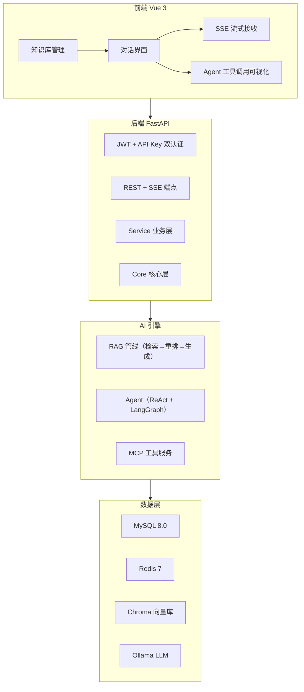
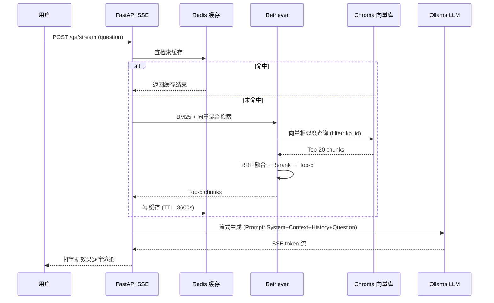
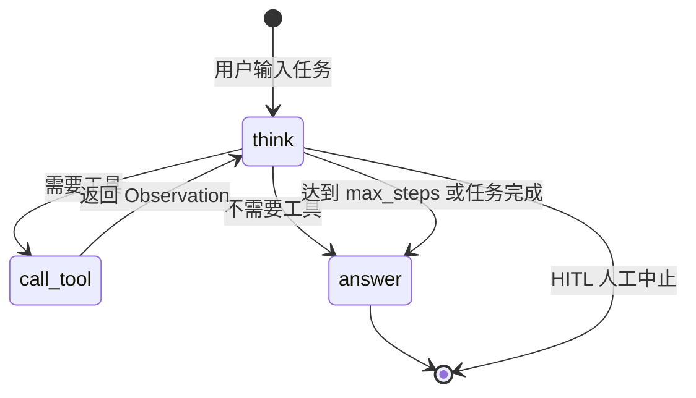

# IntelliKB 智能知识库平台 —— 最终架构方案（含 GitHub 文档规划）

## Part A: 修订后的完整架构方案

---

### A0. 修订说明（第三轮终稿）

| # | 修订项 | 类型 | 影响范围 |
|---|--------|------|---------|
| 1 | API Key bcrypt 哈希（随机盐 + 恒定时间对比） | 🔴 安全修复 | models/user.py, auth_service.py |
| 2 | 向量库 ↔ MySQL 一致性 + 向量 ID = chunk 主键 | 🔴 数据修复 | doc_service.py, vector_store.py |
| 3 | SSE asyncio.Task.cancel() + CancelledError 冒泡 | 🔴 资源泄漏修复 | qa.py, agent.py, rag_service.py |
| 4 | 检索层 kb_id 强制注入 + 权限 Redis 短缓存 | 🔴 越权修复 | retriever.py, rag_service.py, auth_service.py |
| 5 | BackgroundTasks 异步文档解析 + 重启兜底扫描 | 🟡 架构改进 | documents.py, doc_service.py, lifespan |
| 6 | LangGraph Checkpointer (to_thread + Docker volume) | 🟡 状态持久化 | agent_service.py, docker-compose.yml |
| 7 | 高频业务索引 | 🟡 性能优化 | models/, alembic |
| 8 | MCP 官方 SDK + 标准 Server + 统一工具抽象层 | 🟡 协议规范 | mcp_service.py, agent_service.py |
| 9 | RAG 评测 BackgroundTasks 异步 + 状态查询 | 🟡 质量度量 | evaluation.py, models/eval.py |
| 10 | 全局异常处理器 + SSE error 事件规范 | 🟢 健壮性 | main.py, core/exceptions.py |
| 11 | Query Rewrite 查询改写前置层 | 🟢 检索增强 | core/rag/query_rewriter.py |
| 12 | ADR 技术决策记录目录 | 🟢 工程文档 | docs/adr/ |
| 13 | .env.example + config.py description | 🟢 运维规范 | .env.example, config.py |
| 14 | 前端测试框架（vitest + @vue/test-utils） | 🟢 质量保障 | frontend/tests/, package.json, CI |
| 15 | API 速率限制（slowapi + Redis 分级限流） | 🟢 安全防护 | core/security.py, qa.py, auth.py |
| 16 | Docker 镜像版本锁定 | 🟢 部署稳定性 | docker-compose.yml, Dockerfile |
| 17 | 依赖版本锁定（requirements.in + pip-compile） | 🟢 可复现构建 | requirements.in, requirements.txt, CI |

---

### A1. 安全修复：API Key bcrypt 哈希（与密码技术栈对齐）

```python
# core/security.py —— 统一使用 bcrypt（密码 + API Key 同一技术栈）
import bcrypt

def hash_secret(plain: str) -> str:
    """bcrypt 哈希（自动生成随机盐），用于密码和 API Key"""
    return bcrypt.hashpw(plain.encode(), bcrypt.gensalt()).decode()

def verify_secret(plain: str, hashed: str) -> bool:
    """恒定时间对比（防时序攻击）"""
    return bcrypt.checkpw(plain.encode(), hashed.encode())

# services/auth_service.py
def generate_api_key() -> tuple[str, str, str, datetime]:
    """生成 API Key，返回 (原始值, bcrypt哈希, 前缀, 过期时间)。
       原始值仅在生成时返回一次，前端必须提示用户立即保存。"""
    raw = "sk-" + secrets.token_urlsafe(32)
    prefix = raw[:11]            # "sk-XXXXXXXX" 供 UI 识别
    hashed = hash_secret(raw)    # bcrypt $2b$12$...
    expires = datetime.now(UTC) + timedelta(days=365)
    return raw, hashed, prefix, expires
```

```sql
-- sys_user API Key 字段（与密码使用相同 bcrypt 格式）
api_key_hash VARCHAR(255),       -- bcrypt $2b$12$...
api_key_prefix VARCHAR(11),      -- 展示用 "sk-abc123..."
api_key_expires_at DATETIME,
api_key_last_used_at DATETIME,
api_key_enabled BOOLEAN DEFAULT TRUE
```

---

### A2. 数据一致性：向量库 ↔ MySQL 联动

```python
# services/doc_service.py —— 先写 MySQL 再写向量库，异常时回滚
async def store_chunks(self, doc_id: int, kb_id: int, chunks: list[dict]) -> None:
    try:
        # 1. 批量写入 sys_chunk 表（MySQL）
        for i, chunk in enumerate(chunks):
            self.db.add(Chunk(document_id=doc_id, chunk_index=i,
                              content=chunk["text"], metadata=chunk["meta"]))
        await self.db.flush()

        # 2. 写入向量库（向量 ID 策略详见 A12：直接使用 chunk.id 作为向量 ID）
        chunk_records = (await self.db.execute(
            select(Chunk.id).where(Chunk.document_id == doc_id).order_by(Chunk.id)
        )).all()
        ids = [str(r[0]) for r in chunk_records]
        await self.vector_store.add(
            ids=ids,
            embeddings=[c["embedding"] for c in chunks],
            documents=[c["text"] for c in chunks],
            metadatas=[{"doc_id": doc_id, "kb_id": kb_id, "chunk_id": r[0], **c["meta"]}
                       for r, c in zip(chunk_records, chunks)],
        )

        # 3. 更新文档状态
        await self.db.execute(
            update(Document).where(Document.id == doc_id).values(
                status="done", chunk_count=len(chunks)
            )
        )
        await self.db.commit()
    except Exception:
        await self.db.rollback()
        # 向量库写入失败 → 清理已写入的部分（使用 chunk.id）
        raise

# 删除联动
async def delete_document(self, doc_id: int) -> None:
    doc = await self.get_document(doc_id)
    # 1. 删除 sys_chunk（MySQL）
    await self.db.execute(delete(Chunk).where(Chunk.document_id == doc_id))
    # 2. 删除向量数据
    # 向量 ID = chunk.id（策略详见 A12）
    chunk_rows = await self.db.execute(select(Chunk.id).where(Chunk.document_id == doc_id))
    chunk_ids = [str(row[0]) for row in chunk_rows.all()]
    await self.vector_store.delete(chunk_ids)
    # 3. 失效缓存
    await self.invalidate_cache(doc.kb_id)
    # 4. 标记文档删除
    doc.status = "deleted"
    await self.db.commit()

# 巡检脚本（crontab 或 startup 执行）
async def orphan_chunk_cleanup(self) -> dict:
    """清理向量库中在 MySQL 已删除的孤儿数据"""
    # 从向量库获取所有 doc_id（通过 metadata filter）
    vector_doc_ids = await self.vector_store.get_all_doc_ids()
    # 从 MySQL 获取存活 doc_id
    result = await self.db.execute(select(Document.id))
    db_doc_ids = {row[0] for row in result.all()}
    # 差集 = 孤儿
    orphans = vector_doc_ids - db_doc_ids
    if orphans:
        await self.vector_store.delete_by_doc_ids(list(orphans))
    return {"total_vector_chunks": len(vector_doc_ids), "orphans_cleaned": len(orphans)}
```

---

### A3. SSE 中断机制：安全合流 + 心跳自终止 + 异常捕获

```python
# api/v1/qa.py
import asyncio

async def _merge_streams(main_gen, heartbeat_gen):
    """安全合流：主流程结束自动终止心跳协程，无协程泄漏"""
    hb_task = asyncio.create_task(_consume_heartbeat(heartbeat_gen))
    try:
        async for item in main_gen:
            yield item
    finally:
        hb_task.cancel()         # 主流程结束 → 终止心跳
        try: await hb_task
        except asyncio.CancelledError: pass

async def _consume_heartbeat(gen):
    async for item in gen:
        pass  # 由 _merge_streams 的 yield 直接输出，此处仅驱动

@router.post("/qa/stream")
async def qa_stream(request: Request, body: QARequest, ...):
    async def event_generator():
        task = asyncio.create_task(
            rag_service.stream_answer(body.question, body.kb_id)
        )
        try:
            async for token in task:
                if await request.is_disconnected():
                    task.cancel(); break
                yield f"data: {token}\n\n"
        except asyncio.CancelledError:
            logger.info("SSE 取消", extra={"trace_id": get_trace_id()})
        except Exception as e:
            # 异常通过标准 SSE error 事件返回，前端可统一处理
            yield f"event: error\ndata: {{\"code\":\"STREAM_ERROR\",\"message\":\"{str(e)}\"}}\n\n"

    async def _heartbeat():
        try:
            while True:
                await asyncio.sleep(settings.SSE_HEARTBEAT_INTERVAL)
                yield ": ping\n\n"
        except asyncio.CancelledError:
            pass  # 主流程结束 → 自然终止

    merged = _merge_streams(event_generator(), _heartbeat())
    return StreamingResponse(merged, media_type="text/event-stream",
        headers={"Cache-Control": "no-cache", "X-Accel-Buffering": "no", "Connection": "keep-alive"})
```

---

### A4. 检索层权限隔离

```python
# services/rag_service.py —— 强制注入用户可访问的 kb_ids
async def search(self, user_id: int, question: str, kb_id: int) -> list[dict]:
    # 1. 校验用户是否有权访问该知识库
    accessible_kbs = await self._get_accessible_kb_ids(user_id)
    if kb_id not in accessible_kbs:
        raise ForbiddenError("无权访问该知识库")

    # 2. 检索时强制注入 kb_id filter（杜绝越权）
    results = await self.vector_store.query(
        query_embedding=await self.embedder.embed(question),
        top_k=5,
        filter={"kb_id": kb_id},  # ← 服务端强制 filter，不信任前端传入
    )
    return results

async def _get_accessible_kb_ids(self, user_id: int) -> set[int]:
    """获取用户可访问的知识库 ID 集合（我的 + 公开的 + 被添加为成员的）"""
    # 我的知识库
    owned = await self.db.execute(select(KB.id).where(KB.owner_id == user_id))
    # 公开知识库
    public = await self.db.execute(select(KB.id).where(KB.is_public == True))
    # 被添加为成员的知识库
    member = await self.db.execute(
        select(KBMember.kb_id).where(KBMember.user_id == user_id)
    )
    return {row[0] for row in owned.all()} | {row[0] for row in public.all()} | {row[0] for row in member.all()}
```

---

### A5. BackgroundTasks 异步文档解析

```python
# api/v1/documents.py
from fastapi import BackgroundTasks

@router.post("/upload")
async def upload_document(
    file: UploadFile,
    kb_id: int,
    bg: BackgroundTasks,
    current_user: User = Depends(get_current_user),
    db: AsyncSession = Depends(get_db),
):
    # 1. 保存文件 + 创建记录（同步完成）
    doc = await doc_service.create_document(kb_id=kb_id, filename=file.filename, ...)

    # 2. 异步提交解析任务（立即返回）
    bg.add_task(doc_service.parse_document, doc.id)

    # 3. 立即返回 doc_id，前端通过 /documents/{doc_id}/progress 轮询进度
    return APIResponse.created(data={"doc_id": doc.id, "status": "uploading"},
                               message="文档已上传，正在后台解析")

# api/v1/documents.py —— 进度 SSE 端点（保持不变）
@router.get("/{doc_id}/progress")
async def doc_parse_progress(doc_id: int):
    """SSE 实时推送解析进度：uploading → parsing → chunking → indexing → done/error"""
    ...
```

---

### A6. LangGraph Checkpointer（AsyncSqliteSaver 原生异步 + Docker volume）

```python
# requirements.in
langgraph>=0.2,<1.0
langgraph-checkpoint-sqlite>=2.0
aiosqlite>=0.20

# ⚠️ SQLite Checkpointer 仅限开发环境单用户使用，并发写入会触发 database is locked
# 生产环境 → langgraph-checkpoint-postgres + PostgreSQL

# services/agent_service.py
from langgraph.checkpoint.sqlite.aio import AsyncSqliteSaver

class AgentService:
    def _build_graph(self, checkpointer):
        return StateGraph(AgentState).add_node(...).compile(checkpointer=checkpointer)

    async def run_agent(self, conversation_id, user_input, ...):
        # async with 管理连接生命周期（官方推荐模式）
        async with AsyncSqliteSaver.from_conn_string("data/agent_checkpoints.db") as cp:
            graph = self._build_graph(cp)
            config = {"configurable": {"thread_id": str(conversation_id)}}
            async for event in graph.astream(
                {"messages": [HumanMessage(content=user_input)]},
                config=config, stream_mode="values",
            ):
                yield event
```

```yaml
# docker-compose.yml — volume 持久化
services:
  app:
    volumes:
      - checkpointer_data:/app/data
volumes:
  checkpointer_data:
```

---

### A7. 高频业务索引

```sql
-- sys_message: 按会话查询消息（最频繁）
CREATE INDEX idx_msg_conv_created ON sys_message(conversation_id, created_at);

-- sys_document: 按知识库查询文档列表
CREATE INDEX idx_doc_kb_status ON sys_document(kb_id, status);

-- sys_chunk: 按文档查询分块（解析完成后一次性查询）
CREATE INDEX idx_chunk_doc ON sys_chunk(document_id);

-- sys_kb_member: 按用户查知识库权限
CREATE INDEX idx_kbm_user ON sys_kb_member(user_id);

-- sys_conversation: 按用户+知识库查询历史对话
CREATE INDEX idx_conv_user_kb ON sys_conversation(user_id, kb_id, created_at);

-- sys_user: API Key 哈希查询
CREATE INDEX idx_user_apikey ON sys_user(api_key_hash);
```

---

### A8. MCP 模块：官方 JWT 标准认证 + ctx 参数

```python
# requirements.in
fastmcp>=2.0             # 独立 PyPI 包（非 mcp）

# services/mcp_service.py
from fastmcp import FastMCP
from fastmcp.server.auth.providers.jwt import JWTVerifier  # 官方正确导入路径
from app.core.security import JWT_SECRET, JWT_ALGORITHM

verifier = JWTVerifier(
    secret=JWT_SECRET,
    algorithm=JWT_ALGORITHM,     # "HS256"
    issuer="intellikb",
)
mcp = FastMCP("IntelliKB", auth=verifier)

# 工具函数通过 ctx 参数获取官方认证上下文（非 ContextVar，无并发串数据风险）
@mcp.tool()
async def search_knowledge_base(query: str, kb_id: int, ctx) -> list[dict]:
    user_id = ctx.auth.claims["sub"]       # ← ctx 内置认证信息
    accessible = await auth_service.get_user_accessible_kb_ids(user_id)
    if kb_id not in accessible:
        raise PermissionError(f"无权访问知识库 {kb_id}")
    return await rag_service.search(user_id, query, kb_id)

# main.py
app.mount("/mcp", mcp.sse_app())
```

---

### A9. RAG 评测模块：BackgroundTasks 异步 + 状态查询

```sql
-- RAG 评测表
sys_eval_task:
  id INT PK AUTO_INCREMENT,
  kb_id INT FK -> sys_kb.id,
  name VARCHAR(200),                    -- 评测任务名
  status ENUM('running','done','error') DEFAULT 'running',
  total_questions INT DEFAULT 0,
  avg_hit_rate DECIMAL(5,4),            -- 平均命中率
  avg_mrr DECIMAL(5,4),                 -- 平均 MRR
  avg_latency_ms INT,                   -- 平均检索延迟
  created_at DATETIME DEFAULT NOW()

sys_eval_question:
  id INT PK AUTO_INCREMENT,
  task_id INT FK -> sys_eval_task.id,
  question TEXT NOT NULL,               -- 测试问题
  expected_chunk_ids JSON,              -- 预期命中的 chunk ID 列表（标注）
  retrieved_chunk_ids JSON,             -- 实际检索到的 chunk ID 列表
  hit_rate DECIMAL(5,4),                -- 命中率
  reciprocal_rank DECIMAL(5,4),         -- 倒数排名（MRR 用）
  latency_ms INT,                       -- 检索延迟
  created_at DATETIME DEFAULT NOW()
```

```python
# services/evaluation_service.py
class EvalService:
    async def run_evaluation(self, kb_id: int, questions: list[str],
                              expected_chunk_ids: list[list[str]]) -> dict:
        task = EvalTask(kb_id=kb_id, total_questions=len(questions))
        self.db.add(task); await self.db.flush()

        hits, mrrs, latencies = [], [], []
        for q, expected in zip(questions, expected_chunk_ids):
            start = time.perf_counter()
            retrieved = await self.retriever.search(q, kb_id)
            latencies.append((time.perf_counter() - start) * 1000)

            retrieved_ids = [r["id"] for r in retrieved]
            hit = len(set(expected) & set(retrieved_ids)) / len(expected) if expected else 0
            rr = self._reciprocal_rank(expected, retrieved_ids)
            hits.append(hit); mrrs.append(rr)

            self.db.add(EvalQuestion(task_id=task.id, question=q,
                         expected_chunk_ids=expected, retrieved_chunk_ids=retrieved_ids,
                         hit_rate=hit, reciprocal_rank=rr, latency_ms=latencies[-1]))
            task.completed += 1
            await self.db.commit()

        task.status = "done"
        task.avg_hit_rate = sum(hits) / len(hits)
        task.avg_mrr = sum(mrrs) / len(mrrs)
        task.avg_latency_ms = sum(latencies) / len(latencies)
        await self.db.commit()
        return {"avg_hit_rate": task.avg_hit_rate, "avg_mrr": task.avg_mrr,
                "avg_latency_ms": task.avg_latency_ms}
```

### A10. 文档解析重启兜底逻辑（统一 lifespan）

```python
# app/main.py —— FastAPI lifespan 统一管理所有启停逻辑
from contextlib import asynccontextmanager

@asynccontextmanager
async def lifespan(app: FastAPI):
    # ── 启动阶段 ──
    running_tasks: list[asyncio.Task] = []
    # 1. 初始化连接池
    await redis.initialize()
    # 2. 扫描非终态文档 → 重新入队
    async with async_session() as db:
        rows = await db.execute(
            select(Document.id).where(
                Document.status.in_(["uploading", "parsing", "chunking", "indexing"])
            )
        )
        for (doc_id,) in rows.all():
            # 分布式锁防重复（多 Worker 或异常重启场景）
            if await redis.set(f"parse:lock:{doc_id}", "1", nx=True, ex=300):
                running_tasks.append(asyncio.create_task(doc_service.parse_document(doc_id)))
    logger.info("IntelliKB 启动完成")

    yield  # ← 服务运行中

    # ── 停机阶段 ──
    await asyncio.wait_for(asyncio.gather(*running_tasks), timeout=30)
    await redis.close()
    await db_engine.dispose()
    logger.info("IntelliKB 优雅关闭完成")

app = FastAPI(lifespan=lifespan)
```

### A10.1 限流：单 key_func 多维度判断（统一实现，替代旧 A17）

```python
# core/security.py —— 唯一限流实现
def rate_limit_key(request: Request) -> str:
    """认证完成后生成限流 key。优先用户 ID → API Key → IP"""
    if hasattr(request.state, "user_id"):
        return f"user:{request.state.user_id}"
    key = request.headers.get("X-API-Key", "")
    if key:
        # slowapi key_func 是同步函数，不能调用异步代码
        # API Key 在认证中间件中预先验证，user_id 缓存到 request.state
        if hasattr(request.state, "api_key_user_id"):
            return f"apikey:{request.state.api_key_user_id}"
        return f"ip:{get_remote_address(request)}"  # 无效 key 回退 IP 限流
    return f"ip:{get_remote_address(request)}"

# 认证中间件补充：验证 API Key → 写入 request.state.api_key_user_id
# @app.middleware("http")
# async def api_key_middleware(request, call_next):
#     key = request.headers.get("X-API-Key")
#     if key:
#         try:
#             user = await auth_service.verify_api_key(key)  # 异步 bcrypt 校验
#             request.state.api_key_user_id = user.id
#         except AuthError: pass
#     return await call_next(request)

limiter = Limiter(key_func=rate_limit_key, storage_uri=REDIS_URI)

# 分级限流装饰器示例（同一 limiter，由 key_func 自动区分用户类型）
@router.post("/login")        @limiter.limit("5/minute")     # 登录防暴力破解
@router.post("/qa/stream")    @limiter.limit("20/minute")    # 所有用户类型 20/min（key_func 区分 user/apikey/ip 独立计数）
```
> ⚠️ 旧 A17 中的 IP-only 限流实现已删除，统一为此实现。

### A10.2 向量库 filter 语法适配

```python
# core/rag/vector_store.py
class BaseVectorStore(ABC):
    @abstractmethod
    async def query(self, embedding: list[float], top_k: int,
                    filter: dict | None = None) -> list[dict]:
        """filter 统一结构: {"kb_id": 1, "doc_id": 5}"""

class ChromaVectorStore(BaseVectorStore):
    async def query(self, embedding, top_k, filter=None):
        chroma_filter = {k: {"$eq": v} for k, v in (filter or {}).items()}
        # → Chroma native filter dict

class MilvusVectorStore(BaseVectorStore):
    async def query(self, embedding, top_k, filter=None):
        milvus_expr = " and ".join(f'{k} == {v}' for k, v in (filter or {}).items())
        # → Milvus native boolean expression
```

### A10.3 软删除机制

```python
# KB/Document 增加 deleted_at 字段，查询默认过滤
class KB(Base):
    deleted_at: Mapped[datetime | None]  # NULL = 未删除

# repository 层默认过滤
async def list_kbs(self, user_id): 
    stmt = select(KB).where(KB.deleted_at.is_(None), ...)
```

### A10.4 CORS + 文件上传限制

```python
# config.py
CORS_ORIGINS: list[str] = ["http://localhost:5173"]
MAX_UPLOAD_SIZE_MB: int = 50
# main.py
app.add_middleware(CORSMiddleware, allow_origins=settings.CORS_ORIGINS, ...)
# api/v1/documents.py
@router.post("/upload")
async def upload(file: UploadFile = File(..., max_size=settings.MAX_UPLOAD_SIZE_MB * 1024 * 1024)):
    ...
```

### A11. 权限缓存：全局公开 + 用户私有两级

```python
# services/auth_service.py
PERM_CACHE_TTL = 300

# L1: 全局公开知识库缓存（所有用户共享，变更少，TTL 更长）
PUBLIC_CACHE_KEY = "perm:public_kb_ids"
PUBLIC_CACHE_TTL = 600  # 10 分钟

async def get_public_kb_ids(self) -> set[int]:
    """L1 全局缓存：公开知识库 ID 集合"""
    cached = await redis.get(PUBLIC_CACHE_KEY)
    if cached:
        return set(json.loads(cached))
    rows = await self.db.execute(select(KB.id).where(KB.is_public == True))
    result = {r[0] for r in rows.all()}
    await redis.setex(PUBLIC_CACHE_KEY, PUBLIC_CACHE_TTL, json.dumps(list(result)))
    return result

# L2: 用户私有权限缓存（我的 + 被添加为成员，变更频繁，TTL 短）
async def get_user_kb_ids(self, user_id: int) -> set[int]:
    """L2 用户级缓存：owned + member KB IDs"""
    cache_key = f"perm:user_kb:{user_id}"
    cached = await redis.get(cache_key)
    if cached:
        return set(json.loads(cached))

    owned = await self.db.execute(select(KB.id).where(KB.owner_id == user_id))
    member = await self.db.execute(select(KBMember.kb_id).where(KBMember.user_id == user_id))
    result = {r[0] for r in owned.all()} | {r[0] for r in member.all()}
    await redis.setex(cache_key, PERM_CACHE_TTL, json.dumps(list(result)))
    return result

async def get_user_accessible_kb_ids(self, user_id: int) -> set[int]:
    """合并两级缓存"""
    return await self.get_public_kb_ids() | await self.get_user_kb_ids(user_id)

async def invalidate_perm_cache(self, user_id: int | None = None, kb_public_changed: bool = False):
    """精准失效：用户权限变更删 L2，公开状态变更删 L1"""
    if user_id:
        await redis.delete(f"perm:user_kb:{user_id}")
    if kb_public_changed:
        await redis.delete(PUBLIC_CACHE_KEY)
```

### A12. 向量 ID 直接用 MySQL sys_chunk 主键

```python
# 修改前：向量库使用自定义 ID "doc_{doc_id}_chunk_{i}"
# 修改后：向量库 ID = MySQL sys_chunk.id（主键），简化回表与删除

# services/doc_service.py
async def store_chunks(self, doc_id: int, kb_id: int, chunks: list[dict]) -> None:
    for i, chunk in enumerate(chunks):
        self.db.add(Chunk(document_id=doc_id, chunk_index=i,
                          content=chunk["text"], metadata=chunk["meta"]))
    await self.db.flush()  # ← 此时 chunk.id 已生成（AUTO_INCREMENT）

    # 向量库 ID 直接使用 chunk.id
    chunk_records = (await self.db.execute(
        select(Chunk.id, Chunk.content).where(Chunk.document_id == doc_id).order_by(Chunk.id)
    )).all()

    ids = [str(r[0]) for r in chunk_records]          # chunk.id 作为向量 ID
    await self.vector_store.add(
        ids=ids,
        embeddings=[c["embedding"] for c in chunks],
        documents=[c["text"] for c in chunks],
        metadatas=[{"doc_id": doc_id, "kb_id": kb_id, "chunk_id": r[0]} for r, c in zip(chunk_records, chunks)],
    )

# 删除时直接用 chunk.id 定位向量，无需拼字符串
async def delete_chunks(self, chunk_ids: list[int]) -> None:
    await self.vector_store.delete([str(cid) for cid in chunk_ids])
```

### A13. 全局异常处理器 + SSE error 事件规范

```python
# core/exceptions.py
class AppError(Exception):
    """应用统一异常基类"""
    def __init__(self, message: str, code: str, status_code: int = 400):
        self.message = message; self.code = code; self.status_code = status_code

class DocumentParseError(AppError):
    def __init__(self, message: str, doc_id: int, retryable: bool = True):
        super().__init__(message, "DOC_PARSE_ERROR", 500)
        self.doc_id = doc_id; self.retryable = retryable

# main.py —— 全局异常处理器
@app.exception_handler(AppError)
async def app_error_handler(request: Request, exc: AppError):
    return JSONResponse(status_code=exc.status_code, content={
        "code": exc.code, "message": exc.message, "trace_id": get_trace_id(),
    })

# SSE 端点 error 事件规范
# 前端 SSE 监听
# es.addEventListener('error', (e) => {
#   const err = JSON.parse(e.data)
#   ElMessage.error(`[${err.code}] ${err.message}`)
# })
```

### A14. Query Rewrite 查询改写前置层

```python
# core/rag/query_rewriter.py
class QueryRewriter:
    """检索前查询改写：提升召回率，补全指代、扩展同义词"""

    async def rewrite(self, question: str, history: list[dict] | None = None) -> str:
        """将模糊/指代问题改写为独立可检索的查询"""
        if not history:
            return question

        prompt = f"""将以下对话中的最后一条用户问题改写为独立、完整的问题。
        改写规则：
        1. 补全对话历史中的指代（如"它"→具体名词）
        2. 保持原意不变
        3. 用中文回答

        对话历史：
        {self._format_history(history)}

        用户问题：{question}
        改写结果："""

        result = await self.llm.call([{"role": "user", "content": prompt}])
        return result.strip()
```

### A15. 环境配置模板 + config.py description

```bash
# .env.example —— 所有环境变量模板
# ── 数据库 ──
DB_HOST=mysql          # MySQL 地址（Docker: mysql, 本地: localhost）
DB_PORT=3306
DB_USER=root
DB_PASSWORD=devpass123
DB_NAME=intellikb

# ── Redis ──
REDIS_HOST=redis
REDIS_PORT=6379
REDIS_PASSWORD=

# ── LLM ──
LLM_PROVIDER=ollama                    # ollama | deepseek | openai
LLM_BASE_URL=http://ollama:11434/v1   # Ollama API
LLM_API_KEY=ollama                     # DeepSeek/OpenAI 需填真实 Key
LLM_MODEL_NAME=qwen2.5:7b             # 默认模型
LLM_TIMEOUT_SECONDS=60
LLM_MAX_RETRIES=3

# ── Embedding ──
# Phase 1 实测: bge-small-zh 在 Ollama 注册表中不可用，已切换为 nomic-embed-text (768维)
EMBEDDING_MODEL=nomic-embed-text
EMBEDDING_DIM=768

# ── 向量数据库 ──
VECTOR_STORE_BACKEND=chroma           # chroma | milvus
CHROMA_PERSIST_DIR=/app/chroma_data

# ── 缓存 ──
RAG_CACHE_TTL_SECONDS=3600
RAG_CACHE_ENABLED=true

# ── SSE ──
SSE_TIMEOUT_SECONDS=300
SSE_HEARTBEAT_INTERVAL=15

# ── 日志 ──
LOG_LEVEL=INFO                        # DEBUG | INFO | WARNING | ERROR
```

```python
# config.py
from pydantic_settings import BaseSettings
from pydantic import Field

class Settings(BaseSettings):
    model_config = {"env_file": ".env", "env_file_encoding": "utf-8"}

    # 数据库
    DB_HOST: str = Field(default="mysql", description="MySQL 主机地址")
    DB_PORT: int = Field(default=3306, description="MySQL 端口")
    DB_USER: str = Field(default="root", description="数据库用户名")
    DB_PASSWORD: str = Field(default="devpass123", description="数据库密码")
    DB_NAME: str = Field(default="intellikb", description="数据库名")

    # LLM
    LLM_PROVIDER: str = Field(default="ollama", description="LLM 提供商: ollama/deepseek/openai")
    LLM_MODEL_NAME: str = Field(default="qwen2.5:7b", description="模型名称")
    LLM_TIMEOUT_SECONDS: int = Field(default=60, description="LLM 调用超时(秒)")
    LLM_MAX_RETRIES: int = Field(default=3, description="指数退避重试次数")

    # RAG 缓存
    RAG_CACHE_TTL_SECONDS: int = Field(default=3600, description="检索结果缓存 TTL(秒)")
    RAG_CACHE_ENABLED: bool = Field(default=True, description="是否启用检索缓存")
    # ... 其他配置项
```

### A16. 前端测试框架（vitest）

```json
// frontend/package.json 追加
{
  "scripts": { "test": "vitest run", "test:watch": "vitest" },
  "devDependencies": {
    "vitest": "^3.0.0",
    "@vue/test-utils": "^2.4.0",
    "jsdom": "^24.0.0"
  }
}
```
```typescript
// frontend/vitest.config.ts
import { defineConfig } from 'vitest/config'
import vue from '@vitejs/plugin-vue'
export default defineConfig({
  plugins: [vue()],
  test: { environment: 'jsdom', globals: true },
})

// frontend/tests/ChatMessage.test.ts
import { describe, it, expect } from 'vitest'
import { mount } from '@vue/test-utils'
import ChatMessage from '@/components/ChatMessage.vue'

describe('ChatMessage', () => {
  it('renders markdown safely', () => {
    const wrapper = mount(ChatMessage, {
      props: { role: 'assistant', content: '**Hello** <script>alert(1)</script>' }
    })
    expect(wrapper.html()).toContain('<strong>Hello</strong>')
    expect(wrapper.html()).not.toContain('<script>')
  })

  it('shows tool call card for agent messages', () => {
    const wrapper = mount(ChatMessage, {
      props: { role: 'tool', tool_calls: { name: 'search', result: '...' } }
    })
    expect(wrapper.find('.tool-call-card').exists()).toBe(true)
  })
})
```
```yaml
# .github/workflows/test.yml 追加 frontend test step
- name: Frontend tests
  run: cd frontend && npm ci && npx vitest run
```

### A17. Docker 镜像版本锁定

```yaml
# docker-compose.yml —— 所有服务精确版本
services:
  mysql:
    image: mysql:8.0.35            # 精确版本，不用 :latest
  redis:
    image: redis:7.2.4-alpine
  ollama:
    image: ollama/ollama:0.5.1
  app:
    build: .
    # ...
```
```dockerfile
# Dockerfile —— 锁定基础镜像
FROM python:3.11.9-slim-bookworm    # 精确版本
# -- 或使用 digest --
# FROM python:3.11-slim@sha256:abc123...
```

### A18. 依赖版本锁定（pip-compile）

```
# requirements.in —— 声明直接依赖（宽松约束）
fastapi>=0.115,<0.120
uvicorn[standard]>=0.30
sqlalchemy[asyncio]>=2.0,<3.0
langchain>=0.3
langgraph>=0.2
chromadb>=0.5
redis>=5.0
pydantic-settings>=2.0
fastmcp>=2.0
slowapi>=0.1.9
bcrypt>=4.0
prometheus-client>=0.21
pytest>=8.0
```
```bash
# 生成精确锁定版本
pip-compile requirements.in -o requirements.txt
# requirements.txt 示例输出：
# fastapi==0.115.6
# uvicorn==0.30.1
# ...
```
```yaml
# .github/workflows/lint.yml 追加
- name: Verify dependency lock
  run: |
    pip install pip-tools
    pip-compile --check requirements.in  # 检查 lock 文件是否同步
```

### A19. ADR 技术决策记录

```
docs/adr/
├── 001-use-fastapi-async.md        # 为什么选 FastAPI 异步架构
├── 002-vector-store-abstraction.md # 为什么抽象向量数据库接口
├── 003-llm-adapter-pattern.md      # 为什么用适配器模式切换 LLM
├── 004-api-key-bcrypt.md           # 为什么 API Key 用 bcrypt 而非简单哈希（如无盐 SHA-256）
├── 005-mcp-as-agent-tool-layer.md  # 为什么 MCP 是 Agent 唯一工具层
├── 006-vector-id-uses-chunk-pk.md  # 为什么向量 ID 直接使用 chunk 主键
└── 007-rag-cache-strategy.md       # 为什么 RAG 缓存用 Redis + md5(question)
```

```markdown
<!-- docs/adr/004-api-key-bcrypt.md 示例 -->
# ADR-004: API Key 使用 bcrypt 哈希存储

## 状态
已采纳

## 背景
API Key 是用户调用外部 API 的凭证，需与密码同等安全级别。

## 决策
使用 bcrypt 哈希存储 API Key（与密码技术栈对齐），而非简单的无盐哈希算法（如 SHA-256），因为后者易受彩虹表攻击。

## 理由
- bcrypt 自动生成随机盐 + 恒定时间对比，防彩虹表 + 时序攻击
- 与密码哈希统一技术栈，减少依赖
- bcrypt 计算成本可配置（默认 12 rounds）
```

### A20. README 体验优化补充

```markdown
<!-- README.md 追加内容 -->

## 🎬 演示
<!-- 启动后录制以下四个场景的 GIF/WebM，放在 docs/demo/ 目录 -->
| RAG 问答 | Agent 对话 | 文档上传 | 评测看板 |
|-----------|------------|----------|----------|
|  |  |  |  |

## ❓ 常见问题
<details>
<summary>Q: Ollama 模型下载慢怎么办？</summary>

使用国内镜像：`OLLAMA_HOST=https://ollama-mirror.example.com docker compose up -d`
</details>
<details>
<summary>Q: 如何切换到 DeepSeek API？</summary>

修改 `.env`：`LLM_PROVIDER=deepseek` + `LLM_API_KEY=sk-your-key`，重启即可。
</details>
<details>
<summary>Q: 向量库如何从 Chroma 切换到 Milvus？</summary>

修改 `.env`：`VECTOR_STORE_BACKEND=milvus`，无需改代码。
</details>

## 🔑 默认账号
| 角色 | 用户名 | 密码 | 说明 |
|------|--------|------|------|
| 管理员 | admin | admin123 | 首次登录后请立即修改密码 |
| 测试用户 | demo | demo123 | 只读权限，可访问公开知识库 |
```

### A21. Query Rewrite 配置开关 + 简单问题跳过

```python
# config.py
QUERY_REWRITE_ENABLED: bool = True
QUERY_REWRITE_MIN_LENGTH: int = 10        # 少于该长度的关键词查询跳过改写

# core/rag/query_rewriter.py
async def rewrite(self, question: str, history=None) -> str:
    if not settings.QUERY_REWRITE_ENABLED:
        return question
    if len(question) < settings.QUERY_REWRITE_MIN_LENGTH and "?" not in question:
        return question  # 简单关键词跳过
    # ... LLM 改写逻辑
```

### A22. 孤儿清理：增量低频 + 批量删除 by doc_id

```python
# 增量清理（crontab 每小时执行 1 次，每批 100 条）
async def cleanup_orphan_chunks_incremental(self, batch: int = 100) -> dict:
    """配合 Redis 游标，逐步扫描 sys_chunk vs 向量库"""
    ...

# 向量库批量删除能力
async def delete_vectors_by_doc_ids(self, doc_ids: list[int]) -> int:
    for doc_id in doc_ids:
        await self.vector_store.delete(where={"doc_id": doc_id})
```

### A23. 健康检查分层

```python
GET /health/liveness   → {"status":"ok"}                    # 进程存活
GET /health/readiness  → {"status":"ready","checks":{...}}    # 依赖就绪（503 if not）
```

### A24. 接口幂等性

```python
# 基于请求内容的幂等键去重（5 分钟窗口）
key = f"idempotent:qa:{hashlib.sha256(json.dumps(body,sort_keys=True).encode()).hexdigest()[:16]}"
```

### A25. 前端路由守卫 + 权限控制

```typescript
// router/index.ts
router.beforeEach((to, from, next) => {
  const store = useUserStore()
  if (to.meta.requiresAuth && !store.isLoggedIn) return next('/login')
  if (to.meta.role && !store.hasRole(to.meta.role as string)) return next('/403')
  next()
})
// 全部路由使用 () => import() 懒加载
```

### A26. 前端性能优化

```typescript
// vite.config.ts — Element Plus 按需加载 + vendor chunk 拆分 + 打包分析
import { ElementPlusResolver } from 'unplugin-vue-components/resolvers'
import { visualizer } from 'rollup-plugin-visualizer'

manualChunks: { 'element-plus': ['element-plus'], 'vue-vendor': ['vue','vue-router','pinia'] }
```

### A27. GitHub 协作模板 + 压测规划

```
.github/PULL_REQUEST_TEMPLATE.md
scripts/load_test.py                # locust 压测脚本
```

### A28. 文档解析进度：Redis Pub/Sub（多 Worker 支持）

```python
# services/doc_service.py
async def parse_document(self, doc_id: int):
    async for stage in self._parse_stages(doc_id):
        await redis.publish(f"doc:progress:{doc_id}", json.dumps(stage))

# api/v1/documents.py —— SSE 从 Pub/Sub 订阅（支持多 Worker）
async def doc_parse_progress(doc_id: int):
    async def gen():
        pubsub = redis.pubsub()
        await pubsub.subscribe(f"doc:progress:{doc_id}")
        async for msg in pubsub.listen():
            if msg["type"] != "message": continue
            yield {"event": "progress", "data": msg["data"]}
    return EventSourceResponse(gen())
```

### A29. 知识库删除时向量批量清理

```python
async def delete_knowledge_base(self, kb_id: int):
    # 1. 查该知识库所有文档 ID
    doc_ids = [r[0] for r in (await self.db.execute(
        select(Document.id).where(Document.kb_id == kb_id))).all()]
    # 2. 删除 sys_chunk（MySQL）
    await self.db.execute(delete(Chunk).where(
        Chunk.document_id.in_(doc_ids)))
    # 3. 批量删除向量
    await self.vector_store.delete(where={"kb_id": kb_id})
    # 4. 删除文档记录
    await self.db.execute(delete(Document).where(Document.kb_id == kb_id))
    # 5. 删除知识库
    await self.db.execute(delete(KB).where(KB.id == kb_id))
    # 6. 失效所有相关缓存
    await self.invalidate_cache(kb_id)
    await self.db.commit()
```

### A30. Query Rewrite 结果缓存

```python
# 改写结果缓存（同一问题 + 相同历史摘要 → 同一改写结果）
async def rewrite(self, question: str, history: list | None = None) -> str:
    cache_key = f"qr:{hashlib.md5(question.encode()).hexdigest()[:12]}"
    cached = await redis.get(cache_key)
    if cached: return cached.decode()
    result = await self._do_rewrite(question, history)
    await redis.setex(cache_key, 300, result)  # 5 分钟
    return result
```

### A31. 全链路 trace_id 透传

```
用户请求 → FastAPI 中间件生成 trace_id (ContextVar)
  → Service 层 logger 自动注入 trace_id (JSONFormatter)
  → LLM 调用记录 trace_id 到 sys_message.metadata.trace_id
  → MCP 调用时 trace_id 透传至下游工具
  → 响应 Header X-Trace-ID 返回给前端
前端 → 错误时展示 trace_id → 日志中检索完整链路
```

### A32. LLM Token 用量与成本统计

```python
# core/llm/base.py —— 每次调用后记录
class BaseLLM:
    async def call(self, messages, **kwargs):
        start = time.perf_counter()
        result = await self._call(messages, **kwargs)
        latency_ms = (time.perf_counter() - start) * 1000

        # 估算 Token 用量（优先使用 API 返回的 usage 字段）
        prompt_tokens = kwargs.get("usage", {}).get("prompt_tokens", len(str(messages)) // 2)
        completion_tokens = kwargs.get("usage", {}).get("completion_tokens", len(result) // 2)

        # 记录到 Redis（实时统计仪表盘用）
        await redis.hincrby("stats:tokens:daily", "prompt", prompt_tokens)
        await redis.hincrby("stats:tokens:daily", "completion", completion_tokens)
        await redis.hincrby("stats:requests:daily", "total", 1)
        return result
```

### A33. README 姊妹项目联动

```markdown
## 🔗 姊妹项目
| 项目 | 定位 | 技术栈 |
|------|------|--------|
| [rbac-admin](https://github.com/yourname/rbac-admin) | 企业 RBAC 后台管理系统 | FastAPI + Vue 3 + MySQL + Redis + Docker |
| **IntelliKB**（本仓库） | AI 智能知识库平台 | FastAPI + LangGraph + Chroma + Ollama + Vue 3 |

> 两个项目共用 FastAPI 三层架构、JWT 认证、Docker 部署等技术基础，
> rbac-admin 展示传统后端能力，IntelliKB 展示 AI 应用能力。
```

---

## Part B: GitHub 仓库 README 与文档规划

---

### B1. README.md 模板

```markdown
# IntelliKB — AI 智能知识库平台

<p align="center">
  
  
  
  
  
  
  
  
</p>

> 🧠 **一句话定位**：基于 RAG + ReAct Agent 的企业级智能知识库平台，支持多格式文档解析、
> 混合检索问答、Agent 自主推理，内置 MCP 协议标准化工具调用。
>
> 🎯 **面试亮点**：RAG 全链路 · Agent 自主推理 · SSE 流式输出 · 向量数据库抽象层 ·
> API Key 双认证 · Docker 一键部署 · 结构化日志 + Prometheus 可观测性

---

## ✨ 功能特性

| 模块 | 功能 |
|------|------|
| 📄 知识库管理 | 多知识库创建、公开/私有控制、成员权限协作（owner/editor/viewer） |
| 📤 文档管理 | 支持 PDF/Word/Markdown/TXT/HTML 上传，BackgroundTasks 异步解析，SSE 实时进度推送 |
| 🔍 RAG 智能问答 | BM25 + 向量混合检索 → Cross-encoder Rerank → SSE 流式生成 → 打字机效果 |
| 🤖 AI Agent | ReAct 自主推理 + LangGraph 状态图 + HITL 人工确认 + Checkpointer 中断恢复 |
| 🔌 MCP 协议 | Agent 唯一工具接入层，标准化工具注册/发现/调用 |
| 📊 评测看板 | RAG 命中率 (Hit Rate) / MRR / 延迟可视化 |
| 🔐 双认证 | JWT（Web 登录） + API Key 哈希存储（外部 API 调用） |
| 🐳 一键部署 | Docker Compose（含 MySQL/Redis/Ollama/Chroma） + HEALTHCHECK 启动顺序控制 |

---

## 🛠 技术栈

| 层 | 技术 |
|----|------|
| 后端框架 | FastAPI + Pydantic v2 + SQLAlchemy 2.0 async |
| AI 编排 | LangChain + LangGraph + Checkpointer 持久化 |
| 向量数据库 | Chroma（开发）/ Milvus Lite（生产）—— 统一 BaseVectorStore 接口切换 |
| LLM | Ollama 本地 `qwen2.5:7b`（开发）→ DeepSeek/OpenAI API（验收）—— 统一 BaseLLM 接口 |
| Embedding | `nomic-embed-text`（Ollama 本地，768 维）<br>原计划 bge-small-zh 在 Ollama 注册表不可用 |
| 关系数据库 | MySQL 8.0 + Redis 7（缓存 + 会话） |
| 前端 | Vue 3 + TypeScript + Element Plus + Vite 5 |
| 安全 | dompurify (XSS) / bcrypt / API Key bcrypt 哈希 |
| 可观测性 | 结构化 JSON 日志 + trace_id (contextvars) + Prometheus /metrics |
| CI/CD | GitHub Actions（test / build / lint） |
| 部署 | Docker + docker-compose + HEALTHCHECK + wait-for-it |

---

## 🚀 快速开始

### 环境要求
- Docker 24.0+ & docker-compose 2.0+
- 8GB+ RAM（Ollama 本地模型需要）
- 可选：Python 3.11+ & Node.js 20+（本地开发）

### 一键启动
```bash
# 1. 克隆仓库
git clone https://github.com/yourname/intellikb.git && cd intellikb

# 2. 拉取 Ollama 模型（首次）
docker compose run --rm ollama-pull

# 3. 启动全栈服务
docker compose up -d

# 4. 访问
# 前端：http://localhost:5173
# API 文档：http://localhost:8000/docs
# 指标：http://localhost:8000/metrics
```

### 本地开发
```bash
# 后端
python -m venv venv && source venv/bin/activate  # Windows: venv\Scripts\activate
pip install -r requirements.txt
alembic upgrade head
uvicorn app.main:app --reload

# 前端
cd frontend && npm install && npm run dev
```

## 🧪 核心 API 示例

```bash
# 1. 登录获取 Token
curl -X POST http://localhost:8000/api/v1/auth/login \
  -H "Content-Type: application/json" \
  -d '{"username":"admin","password":"admin123"}'

# 2. 创建知识库
curl -X POST http://localhost:8000/api/v1/knowledge-bases \
  -H "Authorization: Bearer <token>" \
  -H "Content-Type: application/json" \
  -d '{"name":"技术文档库","description":"公司内部技术文档","is_public":false}'

# 3. 上传文档
curl -X POST http://localhost:8000/api/v1/documents/upload \
  -H "Authorization: Bearer <token>" \
  -F "file=@document.pdf" -F "kb_id=1"

# 4. RAG 问答（SSE 流式）
curl -N http://localhost:8000/api/v1/qa/stream \
  -H "Authorization: Bearer <token>" \
  -H "Content-Type: application/json" \
  -d '{"question":"什么是 FastAPI？","kb_id":1}'

# 5. 使用 API Key 调用（外部集成）
curl http://localhost:8000/api/v1/qa/stream \
  -H "X-API-Key: sk-xxxxxxxxxxxx" \
  -H "Content-Type: application/json" \
  -d '{"question":"什么是 FastAPI？","kb_id":1}'

# 6. Agent 对话
curl -N http://localhost:8000/api/v1/agent/stream \
  -H "Authorization: Bearer <token>" \
  -H "Content-Type: application/json" \
  -d '{"task":"搜索知识库中关于 Docker 部署的文档，然后总结一份部署清单"}'
```

## 📐 系统架构



### RAG 数据流


### Agent 状态图


## 📊 项目亮点矩阵

| 面试点 | 体现能力 |
|--------|---------|
| RAG 全链路（分块→检索→重排→生成） | AI 工程化能力 |
| 向量数据库抽象层（Chroma/Milvus 切换） | 架构设计 |
| SSE 流式 + 指数退避重连 + 断点续传 | 实时通信 + 容错 |
| asyncio.Task 全链路取消 | 资源管理 |
| Agent ReAct + LangGraph + Checkpointer | 自主推理 + 状态持久化 |
| MCP 作为 Agent 统一工具接入层 | 协议标准化 |
| 检索结果 Redis 缓存 + 文档更新失效 | 性能优化 |
| 检索层强制 kb_id filter（越权防护） | 安全设计 |
| API Key bcrypt 哈希存储 | 安全最佳实践 |
| 向量库 ↔ MySQL 数据一致性 + 孤儿巡检 | 数据完整性 |
| BackgroundTasks 异步文档解析 + SSE 进度 | 用户体验 |
| 结构化日志 + trace_id + Prometheus | 可观测性 |
| Docker HEALTHCHECK + depends_on 启动顺序 | 容器化最佳实践 |
| RAG 评测看板（Hit Rate / MRR） | 质量度量 |
| GitHub Actions CI/CD（test/build/lint） | DevOps |
| pytest + vue-tsc | 质量保障 |

## 📁 项目目录

```
intellikb/
├── .github/workflows/
│   ├── test.yml                # pytest + vue-tsc
│   ├── build.yml               # Docker 镜像构建
│   └── lint.yml                # black + flake8
├── app/
│   ├── main.py                 # FastAPI 入口 + /metrics + lifespan
│   ├── config.py               # pydantic-settings 统一配置
│   ├── api/v1/                 # 路由层（auth/kb/documents/qa/agent/mcp/eval）
│   ├── services/               # 业务逻辑层
│   ├── core/                   # 核心组件（llm/rag/agent/logging/security）
│   ├── models/                 # SQLAlchemy 模型（8 张表）
│   ├── repositories/           # 数据访问层
│   └── schemas/                # Pydantic Schema
├── frontend/
│   └── src/
│       ├── api/                # Axios API 封装
│       ├── views/              # 页面（Login/Dashboard/KB/Chat/Agent/Eval）
│       ├── components/         # 通用组件（ChatMessage/StreamingText/DocUploader）
│       └── store/              # Pinia 状态管理
├── alembic/                    # 数据库迁移
├── tests/                      # pytest + RAG 评测脚本
├── scripts/
│   ├── wait-for-it.sh          # 服务就绪等待
│   ├── pull_model.sh           # Ollama 模型拉取
│   └── seed_data.py            # 演示数据初始化
├── examples/                   # 示例文档
│   ├── fastapi-guide.md
│   └── docker-deploy.pdf
├── docker-compose.yml          # 全栈服务编排 + HEALTHCHECK
├── Dockerfile                  # 多阶段构建
├── README.md                   # 中英双语
├── README_EN.md                # English version
├── CONTRIBUTING.md             # 贡献指南
├── CHANGELOG.md                # 变更记录
├── SECURITY.md                 # 安全说明
└── LICENSE                     # MIT
```

---

## B2. GitHub Actions 自动化流水线

```yaml
# .github/workflows/test.yml
name: Test
on: [push, pull_request]
jobs:
  backend:
    runs-on: ubuntu-latest
    services:
      mysql:
        image: mysql:8.0
        env: { MYSQL_ROOT_PASSWORD: test, MYSQL_DATABASE: test }
        ports: ["3306:3306"]
      redis:
        image: redis:7-alpine
        ports: ["6379:6379"]
    steps:
      - uses: actions/checkout@v4
      - uses: actions/setup-python@v5
        with: { python-version: "3.11" }
      - run: pip install -r requirements.txt
      - run: alembic upgrade head
      - run: pytest tests/ -v --cov=app --cov-report=xml
  frontend:
    runs-on: ubuntu-latest
    steps:
      - uses: actions/checkout@v4
      - uses: actions/setup-node@v4
        with: { node-version: "20" }
      - run: cd frontend && npm ci && npx vue-tsc --noEmit

# .github/workflows/build.yml
name: Build Docker
on:
  push:
    branches: [main]
jobs:
  build:
    runs-on: ubuntu-latest
    steps:
      - uses: actions/checkout@v4
      - run: docker build -t intellikb:latest .
      - run: docker compose -f docker-compose.ci.yml up -d
      - run: docker compose -f docker-compose.ci.yml exec app pytest tests/ -v

# .github/workflows/lint.yml
name: Lint
on: [push, pull_request]
jobs:
  lint:
    runs-on: ubuntu-latest
    steps:
      - uses: actions/checkout@v4
      - uses: actions/setup-python@v5
        with: { python-version: "3.11" }
      - run: pip install black flake8
      - run: black --check app/ tests/
      - run: flake8 app/ tests/ --max-line-length=120
```

---

## B3. 演示数据脚本

```python
# scripts/seed_data.py
"""初始化演示数据：管理员用户 + 示例知识库 + 测试文档"""
import asyncio
from app.database import async_session
from app.models.user import User
from app.models.knowledge_base import KnowledgeBase
from app.services.doc_service import DocService
import bcrypt

async def seed():
    async with async_session() as db:
        # 1. 创建管理员（密码: admin123）
        admin = User(
            username="admin",
            password_hash=bcrypt.hashpw(b"admin123", bcrypt.gensalt()).decode(),
            email="admin@intellikb.dev",
        )
        db.add(admin); await db.flush()

        # 2. 创建示例知识库
        kb = KnowledgeBase(
            owner_id=admin.id, name="技术文档库",
            description="FastAPI / Docker / Python 技术文档合集",
            is_public=True,
        )
        db.add(kb); await db.flush()

        # 3. 导入示例文档
        doc_service = DocService(db)
        for path in ["examples/fastapi-guide.md", "examples/docker-deploy.pdf"]:
            await doc_service.import_document(kb.id, path)

        await db.commit()
        print("✅ 演示数据初始化完成")

if __name__ == "__main__":
    asyncio.run(seed())
```

```yaml
# docker-compose.yml 追加 —— 自动执行初始化
services:
  seed:
    build: .
    command: python scripts/seed_data.py
    depends_on:
      app:
        condition: service_healthy
    restart: "no"  # 仅执行一次
```

```markdown
# examples/fastapi-guide.md
# FastAPI 入门指南
FastAPI 是一个现代、快速的 Web 框架，用于构建 Python API...
## 核心特性
- 自动生成 OpenAPI 文档
- 基于 Python 类型提示的数据验证
- 原生异步支持
```

---

## B4. 项目文档文件

### CONTRIBUTING.md 结构
```
# 贡献指南
1. 环境搭建（python venv + node + docker）
2. 开发流程（git flow → 开 issue → 新分支 → PR）
3. 提交规范（feat/fix/docs/refactor/test/chore）
4. 代码风格（black 120 字符行宽、flake8、ESLint）
5. 测试要求（pytest 覆盖率 > 80%）
```

### CHANGELOG.md 结构
```
# Changelog
## [Phase 2] RAG 问答 — 2026-08-XX
### Added
- BM25 + 向量混合检索 + RRF 融合
- Cross-encoder Rerank
- SSE 流式输出 + StreamText 组件
- Redis 检索结果缓存
### Changed
- ...
### Fixed
- ...
```

### SECURITY.md 结构
```
# 安全说明
## API Key 管理
- API Key 使用 bcrypt 哈希存储，原始值仅在生成时返回一次
- 支持过期时间与吊销
## 输入校验
- 所有用户输入经过 Pydantic 校验
- Markdown 渲染使用 dompurify 防 XSS
## 权限隔离
- 检索层强制注入 kb_id filter，防止越权
- 知识库成员角色：owner > editor > viewer
```

---

## B5. 提交记录规范与快速启动脚本

### 约定式提交
```
feat(rag): 添加 BM25 + 向量混合检索
fix(sse): 修复客户端断开后资源未清理的问题
docs(readme): 添加中英双语架构图
refactor(auth): API Key 改为 bcrypt 哈希存储
test(eval): 添加 RAG 命中率评测用例
chore(docker): 添加 HEALTHCHECK 健康检查
```

### 快速启动脚本（scripts/dev.sh）
```bash
#!/bin/bash
set -e
case "$1" in
  up)     docker compose up -d ;;
  down)   docker compose down ;;
  test)   docker compose exec app pytest tests/ -v ;;
  lint)   black --check app/ tests/ && flake8 app/ tests/ ;;
  seed)   docker compose exec app python scripts/seed_data.py ;;
  logs)   docker compose logs -f app ;;
  *)      echo "Usage: ./scripts/dev.sh {up|down|test|lint|seed|logs}" ;;
esac
```

---

## Part C: 数据库完整设计（最终版）

```sql
-- 用户
sys_user:
  id, username, password_hash, email,
  api_key_hash VARCHAR(255), api_key_prefix VARCHAR(11),
  api_key_expires_at DATETIME, api_key_last_used_at DATETIME,
  api_key_enabled BOOLEAN DEFAULT TRUE,
  created_at, updated_at

-- 知识库
sys_kb:
  id, owner_id FK, name, description,
  is_public BOOLEAN DEFAULT FALSE,
  embedding_model, chunk_size, chunk_overlap,
  deleted_at DATETIME DEFAULT NULL,
  created_at, updated_at

-- 知识库成员
sys_kb_member:
  id, kb_id FK, user_id FK,
  role ENUM('owner','editor','viewer'),
  created_at, updated_at

-- 文档
sys_document:
  id, kb_id FK, filename, file_type,
  status ENUM('uploading','parsing','chunking','indexing','done','error','deleted'),
  chunk_count, file_size, error_message, parse_retry_count,
  deleted_at DATETIME DEFAULT NULL,
  created_at, updated_at

-- 文档分块
sys_chunk:
  id, document_id FK, chunk_index,
  content TEXT, metadata JSON,     -- {page, source, token_count}
  created_at

-- 对话会话
sys_conversation:
  id, user_id FK, kb_id FK, title,
  mode ENUM('qa','agent'),
  created_at, updated_at

-- 对话消息
sys_message:
  id, conversation_id FK,
  role ENUM('user','assistant','tool','tool_result'),
  content TEXT, tool_calls JSON,
  metadata JSON,                    -- {trace_id, token_count, latency_ms, model, retrieved_chunks}
  created_at

-- RAG 评测任务
sys_eval_task:
  id, kb_id FK, name,
  status ENUM('running','done','error'),
  total_questions, completed INT DEFAULT 0,
  avg_hit_rate, avg_mrr, avg_latency_ms,
  created_at

-- RAG 评测问题
sys_eval_question:
  id, task_id FK,
  question TEXT, expected_chunk_ids JSON,
  retrieved_chunk_ids JSON, hit_rate, reciprocal_rank, latency_ms,
  created_at

-- 软删除说明：
-- KB 和 Document 使用软删除，查询默认过滤 deleted_at IS NULL，定期物理清理 deleted_at < NOW() - 30d
```

---

## Part D: 开发阶段规划（最终版）

| 阶段 | 内容 | 关键交付 | GitHub 里程碑 |
|------|------|---------|:--:|
| **Phase 0** | 脚手架 + Docker + JWT + API Key 哈希 | 可运行空壳 + 登录页 | v0.1.0 |
| **Phase 1** | 知识库 + 文档管理 + BackgroundTasks 解析 + SSE 进度 | KB CRUD + 文档管理 | v0.2.0 |
| **Phase 2** | RAG 问答：混合检索 + Rerank + SSE 流式 + Redis 缓存 | 打字机效果对话 | v0.3.0 |
| **Phase 3** | Agent 对话：ReAct + LangGraph + Checkpointer + MCP 统一工具层 | 工具调用可视化 | v0.4.0 |
| **Phase 4** | RAG 评测看板 + Prometheus + GitHub Actions CI/CD | 技术深度 | v0.5.0 |
| **Phase 5** | 测试 + 文档 + 双语 README + 演示数据 + 安全审计 | 交付质量 | v1.0.0 |
| **Phase 6** | 运维体系：备份恢复 + Prometheus/Grafana 监控 + 压测 + 敏感信息审计 | 生产就绪 | v1.1.0 |

---

## Part E: 运维与质量保障

### E1. 数据库备份与恢复

```bash
# scripts/backup.sh —— mysqldump 定时备份
#!/bin/bash
BACKUP_DIR="/backups/mysql"
mkdir -p "$BACKUP_DIR"
docker compose exec -T mysql mysqldump -u root -p"${DB_PASSWORD}" intellikb \
  | gzip > "$BACKUP_DIR/intellikb_$(date +%Y%m%d_%H%M).sql.gz"
# 保留最近 7 天
find "$BACKUP_DIR" -name "*.sql.gz" -mtime +7 -delete
```

```python
# scripts/vector_backup.py —— Chroma 向量库导出/导入（JSON 格式）
# 导出: python scripts/vector_backup.py export --output backup/vectors.json
# 导入: python scripts/vector_backup.py import --input backup/vectors.json
```

### E2. Prometheus + Grafana 监控

```yaml
# prometheus/prometheus.yml
scrape_configs:
  - job_name: 'intellikb'
    scrape_interval: 15s
    static_configs:
      - targets: ['app:8000']
```

```yaml
# prometheus/alert_rules.yml
groups:
  - name: intellikb
    rules:
      - alert: HighErrorRate
        expr: rate(rag_requests_total{status="error"}[5m]) > 0.05
        annotations: { summary: "RAG 错误率 > 5%" }
      - alert: HighLatency
        expr: histogram_quantile(0.95, rag_latency_seconds) > 10
        annotations: { summary: "RAG P95 延迟 > 10s" }
```

```yaml
# docker-compose.yml 追加
prometheus:
  image: prom/prometheus:v3.1.0
  volumes: [./prometheus:/etc/prometheus]
  ports: ["9090:9090"]
grafana:
  image: grafana/grafana:11.4.0
  volumes: [./grafana/dashboards:/etc/grafana/provisioning/dashboards]
  ports: ["3000:3000"]
```

### E3. 测试策略文档

```
docs/testing-strategy.md

1. 单元测试（pytest > 80% 覆盖率）
   - Service 层 Mock LLM / VectorStore / Redis
   - Repository 层使用测试 DB

2. 集成测试（TestClient + 真实依赖）
   - 文档上传 → 解析 → RAG 问答端到端

3. RAG 评测（自动化 Hit Rate / MRR）
   - 标注测试问题集 + 预期 chunk

4. 前端测试（Vitest + Vue Test Utils）
   - ChatMessage 渲染 / StreamingText 重连 / DocUploader 进度

5. E2E 测试（Playwright）
   - 登录 → 创建知识库 → 上传文档 → 提问 → 验证回答
```

### E4. 性能基准测试

```python
# tests/benchmark/test_rag_performance.py
import pytest
from pytest_benchmark.fixture import BenchmarkFixture

def test_rag_search_qps(benchmark: BenchmarkFixture):
    """RAG 检索 QPS 基准"""
    result = benchmark(lambda: asyncio.run(rag_service.search(1, "测试问题", kb_id=1)))
    assert len(result) > 0

# 使用 locust: locust -f scripts/load_test.py --users 50 --spawn-rate 5
```

### E5. 敏感信息脱敏

```python
# core/logging.py
class SensitiveDataFilter(logging.Filter):
    SENSITIVE_KEYS = {"password", "api_key", "token", "authorization", "secret"}

    def filter(self, record: logging.LogRecord) -> bool:
        if hasattr(record, "msg") and isinstance(record.msg, str):
            for key in self.SENSITIVE_KEYS:
                record.msg = re.sub(rf'("{key}"\s*:\s*)"[^"]*"', r'\1"***REDACTED***"', record.msg)
        return True

# 注册到 root logger
logging.getLogger().addFilter(SensitiveDataFilter())
```

### E6. 依赖许可证检查

```yaml
# .github/workflows/license-check.yml
- name: Check licenses
  run: |
    pip install pip-licenses
    pip-licenses --allow-only="MIT;BSD;Apache 2.0;ISC;Python Software Foundation;Mozilla Public License 2.0" \
      --fail-on="GPL;AGPL;LGPL" 2>&1 | tee license-report.txt
```

### E7. 前端错误边界

```html
<!-- components/ErrorBoundary.vue -->
<template>
  <div v-if="error" class="error-boundary">
    <el-result icon="error" title="组件加载失败" :sub-title="error.message">
      <template #extra><el-button @click="reset">重试</el-button></template>
    </el-result>
  </div>
  <slot v-else />
</template>
<script setup>
import { ref, onErrorCaptured } from 'vue'
const error = ref<Error | null>(null)
onErrorCaptured((err) => { error.value = err; return false })
const reset = () => { error.value = null }
</script>
```

### E8. API 版本管理

```markdown
# docs/api-versioning.md
- URL 版本: /api/v1/... → /api/v2/...
- 废弃通知 Header: `X-API-Deprecated: true` + `Sunset: <date>`（≥6个月）
- 迁移指南: 每个 Major 版本提供 migration.md
```

---

## Part F: 最终修订补丁（本轮定稿）

### F1. RAG 评测：BackgroundTasks 异步执行 + 状态查询

```python
# api/v1/evaluation.py
@router.post("/eval/tasks")
async def create_eval_task(body: EvalCreateRequest, bg: BackgroundTasks, ...):
    task = EvalTask(kb_id=body.kb_id, total_questions=len(body.questions), status="pending")
    self.db.add(task); await self.db.commit()
    bg.add_task(eval_service.run_evaluation_async, task.id, body.questions, body.expected)
    return {"task_id": task.id, "status": "pending"}   # 立即返回

@router.get("/eval/tasks/{task_id}")
async def get_eval_status(task_id: int):
    task = await self.db.get(EvalTask, task_id)
    if task.status == "done":
        return {"task_id": task.id, "avg_hit_rate": task.avg_hit_rate, ...}
    return {"task_id": task.id, "status": task.status, "progress": f"{task.completed}/{task.total_questions}"}
```

### F2. 向量库删除统一抽象 + 软删除 + 最终一致性

```python
# core/rag/vector_store.py
class BaseVectorStore(ABC):
    @abstractmethod
    async def delete(self, ids: list[str] | None = None,
                     filter: dict | None = None) -> int: ...
    # filter 统一结构 {"kb_id": 1}，适配器内部转换

class ChromaVectorStore:
    async def delete(self, ids=None, filter=None):
        if ids: return self.collection.delete(ids=ids)
        if filter:
            chroma_filter = {k: {"$eq": v} for k, v in filter.items()}
            return self.collection.delete(where=chroma_filter)

class MilvusVectorStore:
    async def delete(self, ids=None, filter=None):
        expr = f'pk in {ids}' if ids else ' and '.join(f'{k}=={v}' for k,v in filter.items())
        return self.collection.delete(expr)
```

```python
# 软删除统一：所有 DELETE API → db.execute(update(Model).where(...).values(deleted_at=now()))
# 所有查询默认 → .where(Model.deleted_at.is_(None))
# 定期物理清理 → crontab 脚本扫 deleted_at < now() - 30d

# 最终一致性补偿
async def vector_consistency_check():
    """巡检死信：MySQL 已软删除但向量库残留 → 重试删除"""
    ...
```

### F3. Query Rewrite 缓存：仅无历史时启用

```python
async def rewrite(self, question: str, history: list | None = None) -> str:
    if not settings.QUERY_REWRITE_ENABLED: return question
    # 仅无历史对话时启用缓存
    if history:
        return await self._do_rewrite(question, history)
    cache_key = f"qr:{hashlib.md5(question.encode()).hexdigest()[:12]}"
    cached = await redis.get(cache_key)
    if cached: return cached.decode()
    result = await self._do_rewrite(question)
    await redis.setex(cache_key, 300, result)
    return result
```

### F4. Pub/Sub 连接释放

```python
# api/v1/documents.py
async def doc_parse_progress(doc_id: int):
    async def gen():
        pubsub = redis.pubsub()
        await pubsub.subscribe(f"doc:progress:{doc_id}")
        try:
            async for msg in pubsub.listen():
                if await request.is_disconnected():   # 客户端断开 → 取消订阅
                    break
                if msg["type"] == "message":
                    yield {"event": "progress", "data": msg["data"]}
        finally:
            await pubsub.unsubscribe()   # 释放连接
            await pubsub.close()
    return EventSourceResponse(gen())
```

### F5. 可选加分项

| # | 项 | 实现要点 |
|---|-----|---------|
| 1 | API Key 配额 | Redis 计数器 `apikey:{id}:daily`，超额 → 429 |
| 2 | 按知识库向量集合隔离 | `chroma_client.create_collection(f"kb_{kb_id}")` → 检索时按 kb_id 选集合 |
| 3 | 限流响应头 | Response Headers: `X-RateLimit-Limit/Remaining/Reset` |
| 4 | 向量索引预热 | startup 时对每个 collection 执行一次空查询 → 触发索引加载 |

### F6. 此次修复的问题清单

| # | 类型 | 问题 | 状态 |
|---|:--:|------|:--:|
| 1 | 🔴 | MCP JWTVerifier 导入路径 + 依赖缺失 | ✅ 已修复 |
| 2 | 🔴 | MCP ContextVar 异步并发串数据 | ✅ 改用官方 ctx 参数 |
| 3 | 🔴 | SSE `_merge_streams` 未定义 | ✅ 已实现 |
| 4 | 🔴 | 心跳协程无限循环泄漏 | ✅ 主流程结束自动取消 |
| 5 | 🔴 | 生成器异常未捕获 | ✅ SSE error 事件标准化 |
| 6 | 🔴 | AsyncSqliteSaver 单例并发锁 | ✅ async with 管理 |
| 7 | 🟡 | RAG 评测同步执行 | ✅ BackgroundTasks 异步 |
| 8 | 🟡 | 限流两套实现重复 | ✅ 统一为单 key_func |
| 9 | 🟡 | 向量库删除 filter 未抽象 | ✅ 统一接口 + 适配器转换 |
| 10 | 🟡 | QR 缓存未区分上下文 | ✅ 有历史时跳过缓存 |
| 11 | 🟡 | 软删除设计与实现脱节 | ✅ 统一软删除 + 定期清理 |
| 12 | 🟡 | 重启解析无分布式锁 | ✅ Redis SET NX 防重复 |
| 13 | 🟡 | Pub/Sub 连接未释放 | ✅ disconnect 时 unsubscribe |
| 14 | 🟢 | 最终一致性 + 配额 + 集合隔离 + 限流头 + 预热 | ✅ 设计已补充 |

---

## Part G: 生产就绪加固

### G1. 多环境配置管理

```yaml
# docker-compose.dev.yml —— 开发环境（Ollama 本地 + DEBUG 日志 + 热重载）
services:
  app:
    build: .
    environment:
      - ENVIRONMENT=development
      - LLM_PROVIDER=ollama
      - LLM_BASE_URL=http://ollama:11434/v1
      - LOG_LEVEL=DEBUG
    volumes: [.:/app]    # 热重载
    command: uvicorn app.main:app --reload --host 0.0.0.0

# docker-compose.prod.yml —— 生产环境（DeepSeek API + WARNING 日志）
services:
  app:
    build: .
    environment:
      - ENVIRONMENT=production
      - LLM_PROVIDER=deepseek
      - LLM_API_KEY=${DEEPSEEK_API_KEY}
      - LOG_LEVEL=WARNING
    restart: always
    deploy:
      resources: { limits: { memory: 2G } }
```

```python
# config.py —— 环境感知配置
from enum import Enum
class Environment(str, Enum):
    DEVELOPMENT = "development"
    STAGING = "staging"
    PRODUCTION = "production"

class Settings(BaseSettings):
    ENVIRONMENT: Environment = Environment.DEVELOPMENT

    @property
    def is_production(self) -> bool:
        return self.ENVIRONMENT == Environment.PRODUCTION

    @property
    def log_level(self) -> str:
        return "WARNING" if self.is_production else "DEBUG"

    @property
    def debug_mode(self) -> bool:
        return self.ENVIRONMENT == Environment.DEVELOPMENT

    @property
    def db_echo(self) -> bool:
        """SQLAlchemy echo：仅开发环境开启"""
        return self.ENVIRONMENT == Environment.DEVELOPMENT
```

### G2. 依赖安全扫描

```yaml
# .github/workflows/security-scan.yml
name: Security Scan
on:
  push:
  schedule:
    - cron: '0 8 * * 1'  # 每周一 08:00 UTC
jobs:
  trivy-python:
    runs-on: ubuntu-latest
    steps:
      - uses: actions/checkout@v4
      - uses: aquasecurity/trivy-action@master
        with:
          scan-type: fs
          scanners: vuln,secret
          severity: HIGH,CRITICAL
          exit-code: 1   # 高危漏洞阻断构建

  trivy-npm:
    runs-on: ubuntu-latest
    steps:
      - uses: actions/checkout@v4
      - run: cd frontend && npm ci
      - uses: aquasecurity/trivy-action@master
        with:
          scan-type: fs
          scan-ref: frontend/node_modules
          scanners: vuln
          severity: HIGH,CRITICAL
```

```yaml
# .github/dependabot.yml —— 自动依赖更新检测
version: 2
updates:
  - package-ecosystem: pip
    directory: /
    schedule: { interval: weekly }
    open-pull-requests-limit: 5
    labels: [dependencies]
  - package-ecosystem: npm
    directory: /frontend
    schedule: { interval: weekly }
    open-pull-requests-limit: 5
    labels: [dependencies]

  - package-ecosystem: docker
    directory: /
    schedule: { interval: monthly }
```

---

### G3. 文件上传安全限制

```python
# config.py
MAX_UPLOAD_SIZE_MB: int = 50
ALLOWED_MIME_TYPES: list[str] = [
    "application/pdf",
    "application/vnd.openxmlformats-officedocument.wordprocessingml.document",
    "text/markdown", "text/plain", "text/html",
]
UPLOAD_RATE_LIMIT: str = "10/minute"

# api/v1/documents.py
import magic   # python-magic

@router.post("/upload")
@limiter.limit(UPLOAD_RATE_LIMIT)
async def upload_document(
    file: UploadFile = File(..., max_size=settings.MAX_UPLOAD_SIZE_MB * 1024 * 1024),
    kb_id: int = Form(...),
    bg: BackgroundTasks = Depends(),
    ...
):
    # 1. MIME 白名单
    if file.content_type not in settings.ALLOWED_MIME_TYPES:
        raise BusinessError(f"不支持的文件类型: {file.content_type}")

    # 2. 魔术字节检测（防伪造 Content-Type）
    header = await file.read(2048)
    await file.seek(0)
    detected = magic.from_buffer(header, mime=True)
    if detected not in settings.ALLOWED_MIME_TYPES:
        logger.warning("文件魔术字节不匹配", extra={
            "claimed": file.content_type, "detected": detected, "trace_id": get_trace_id(),
        })
        raise BusinessError(f"文件类型校验失败: 声明 {file.content_type}，实际 {detected}")

    # 3. 保存 + 异步解析
    doc = await doc_service.create(kb_id=kb_id, filename=file.filename, ...)
    bg.add_task(doc_service.parse_document, doc.id)
    return {"doc_id": doc.id, "status": "uploading"}
```

### G4. 日志轮转

```yaml
# docker-compose.yml —— 容器日志限制
services:
  app:
    logging:
      driver: json-file
      options: { max-size: "10m", max-file: "3" }
```

```bash
# scripts/log_rotate.sh —— 应用日志归档
#!/bin/bash
LOG_DIR="/app/logs"
find "$LOG_DIR" -name "*.log" -size +50M | while read f; do
  gzip "$f" && mv "$f.gz" "$f.$(date +%Y%m%d).gz"
done
# 删除 7 天前的归档
find "$LOG_DIR" -name "*.gz" -mtime +7 -delete
```

```python
# core/logging.py —— 日志文件大小检查
import os
MAX_LOG_SIZE = 50 * 1024 * 1024  # 50MB

def setup_logging():
    log_file = "logs/app.log"
    if os.path.exists(log_file) and os.path.getsize(log_file) > MAX_LOG_SIZE:
        # 触发轮转告警（依赖外部 log_rotate.sh）
        logger.warning("日志文件超过 50MB，建议执行 log_rotate.sh")
```

### G5. CORS 安全配置

```python
# config.py
class Settings(BaseSettings):
    CORS_ORIGINS: list[str] = Field(
        default=["http://localhost:5173"],
        description="允许的跨域源地址（逗号分隔）",
    )
    CORS_ALLOW_METHODS: list[str] = Field(
        default=["GET", "POST", "PUT", "DELETE", "OPTIONS"],
    )
    CORS_ALLOW_HEADERS: list[str] = Field(
        default=["Authorization", "X-API-Key", "Content-Type", "X-Trace-ID"],
    )

    @property
    def cors_origins_list(self) -> list[str]:
        """生产环境从环境变量读取，开发环境用默认值"""
        if self.is_production:
            return self.CORS_ORIGINS   # 必须显式配置，不允许 '*'
        return ["http://localhost:5173", "http://localhost:3000"]

# main.py
from fastapi.middleware.cors import CORSMiddleware

app.add_middleware(
    CORSMiddleware,
    allow_origins=settings.cors_origins_list,
    allow_credentials=True,
    allow_methods=settings.CORS_ALLOW_METHODS,
    allow_headers=settings.CORS_ALLOW_HEADERS,
    expose_headers=["X-Trace-ID", "X-RateLimit-Limit", "X-RateLimit-Remaining", "X-RateLimit-Reset"],
)
```


## Part H: 面试展示材料

### H1. README "相关项目" 章节

```markdown
## 🔗 相关项目

| 项目 | 定位 | 技术栈 | 关系 |
|------|------|--------|------|
| [rbac-admin](https://github.com/yourname/rbac-admin) | 企业级 RBAC 后台管理系统 | FastAPI + Vue 3 + MySQL + Redis + Docker | 同技术栈基础 |
| **IntelliKB**（本仓库） | AI 智能知识库平台 | FastAPI + LangGraph + Chroma + Ollama + Vue 3 | AI 能力延伸 |

> **为什么需要两个项目？**
> - rbac-admin 展示**传统企业后端**能力：RBAC 权限模型、审批工作流引擎、事务并发控制
> - IntelliKB 展示**AI 应用开发**能力：RAG 全链路、Agent 自主推理、LLM 工程化
> - 两个项目共享 FastAPI 三层架构 + Vue 3 + Docker 技术基础，形成「后端 + AI」双引擎
>
> **面试时怎么讲？**
> - 后端岗：重点讲 rbac-admin 的 RBAC 和审批引擎；IntelliKB 作为"AI 应用经验"加分项
> - AI 岗：重点讲 IntelliKB 的 RAG 和 Agent；rbac-admin 作为"工程化能力"背书
> - 全栈岗：两项目并重，强调从数据库到前端的完整交付能力
```

### H2. docs/project-comparison.md 项目对比文档

```markdown
# 项目对比：rbac-admin vs IntelliKB

## 一句话差异
rbac-admin = "我懂企业级后端架构" | IntelliKB = "我会做 AI 产品"

## 技术栈对比

| 维度 | rbac-admin | IntelliKB |
|------|-----------|-----------|
| 后端框架 | FastAPI + Pydantic v2 | FastAPI + Pydantic v2 |
| 数据库 | MySQL 8.0 + SQLAlchemy 2.0 | MySQL 8.0 + Chroma + SQLAlchemy 2.0 |
| 缓存 | Redis 7（会话+限流） | Redis 7（会话+检索缓存+权限缓存） |
| 前端 | Vue 3 + Element Plus | Vue 3 + Element Plus |
| 认证 | JWT 双Token + RBAC 五表 | JWT + API Key（bcrypt）双认证 |
| 实时通信 | WebSocket 通知 | SSE 流式输出 |
| AI 集成 | 无 | LangChain + LangGraph + Ollama |
| 部署 | Docker Compose | Docker Compose + HEALTHCHECK + wait-for-it |

## 业务对比

| 维度 | rbac-admin | IntelliKB |
|------|-----------|-----------|
| 核心业务 | 权限管理 + 审批工作流 | 知识库 + RAG 问答 + Agent |
| 用户体系 | 五表 RBAC（用户/角色/菜单/部门/岗位） | 简化用户 + API Key + 知识库成员 |
| 核心流程 | 发起→审批→会签→归档 | 上传→解析→检索→生成 |
| 并发特点 | 事务密集（乐观锁） | 读密集（检索缓存） |

## 面试岗位讲解策略

### 后端开发岗
1. 主力：rbac-admin（RBAC + 审批引擎 + 乐观锁）
2. 加分：IntelliKB（"我还做过 AI 项目，了解 RAG 原理"）
3. 关键话术："我用同一套 FastAPI 架构做了两个项目"

### AI 应用开发岗
1. 主力：IntelliKB（RAG + Agent + MCP + 流式输出）
2. 加分：rbac-admin（"我有扎实的后端工程基础"）
3. 关键话术："AI 应用不能只在 Notebook 里跑，我把它做成了可部署的产品"

### 全栈开发岗
1. 并重：两项目展示前后端全覆盖
2. 关键话术："两个项目覆盖了从数据库到前端、从 RBAC 到 AI 的完整技术图谱"
```

### H3. docs/interview-cheat-sheet.md 面试速查

```markdown
# IntelliKB 面试速查手册

## 30 秒自我介绍模板
"我做过两个全栈项目。一个是 rbac-admin 企业后台管理系统，实现了 RBAC 五表权限
和审批工作流引擎。另一个是 IntelliKB 智能知识库平台，实现了 RAG 问答和 Agent
自主推理，用 FastAPI + LangGraph + Chroma + Vue 3 全栈开发，Docker 一键部署。"

## 按岗位的核心亮点

### AI 应用开发岗
| # | 亮点 | 一句话 |
|---|------|--------|
| 1 | RAG 全链路 | "从文档解析、混合检索、Rerank 到 SSE 流式输出，完整实现" |
| 2 | Agent ReAct | "基于 LangGraph 的自主推理，Thought→Action→Observation 循环" |
| 3 | 工程化 | "不是 Demo，有 pytest、CI/CD、Docker、Prometheus 可观测性" |

### 后端开发岗
| # | 亮点 | 一句话 |
|---|------|--------|
| 1 | 三层架构 | "Router → Service → Repository 标准分层" |
| 2 | 并发安全 | "乐观锁、Redis 分布式锁、asyncio 异步全链路" |
| 3 | AI 加分 | "额外做过 RAG + Agent 项目，了解 LLM 集成" |

## 常见追问与回答

**Q: RAG 检索不准怎么办？**
A: "我从三个层面优化——检索前 Query Rewrite 改写模糊问题；
检索中用 BM25+向量混合+RRF融合提升召回；检索后用 Cross-encoder Rerank 提升精度。
还有评测看板的 Hit Rate 和 MRR 指标可量化衡量效果"

**Q: Agent 跑飞了怎么控制？**
A: "三个机制——max_steps 硬限制（10 步）；HITL 人工确认关键操作；
asyncio.Task.cancel() + CancelledError 冒泡实现随时中断"

**Q: 两个项目的技术栈好像差不多，为什么不合并？**
A: "刻意分开的。rbac-admin 展示传统后端能力，IntelliKB 展示 AI 能力。
合并在一起反而会让面试官觉得我没有个人项目规划的思考。
两个项目用同一套 FastAPI 架构恰恰说明了我的技术栈可复用——这是工程能力的体现"

**Q: 为什么用 Ollama 而不是直接用 OpenAI？**
A: "开发期用 Ollama 零成本本地调试，验收时通过 LLM 抽象层一行配置切换到
DeepSeek API 或 OpenAI。适配器模式保证了切换成本为零"
```

